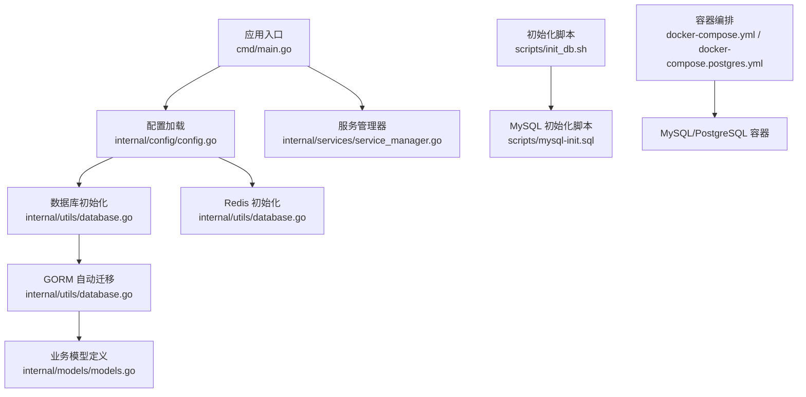
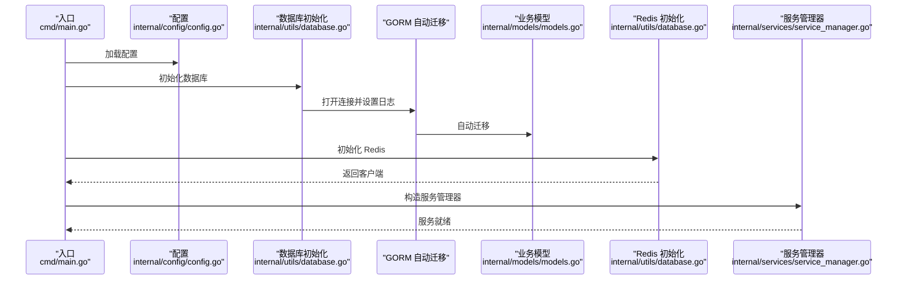
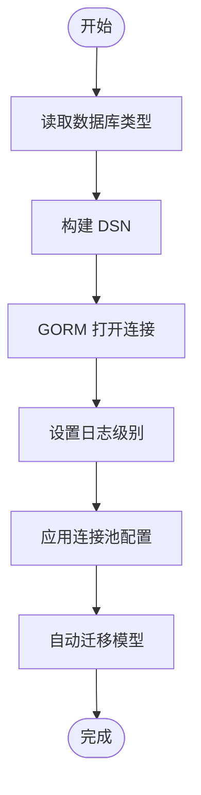
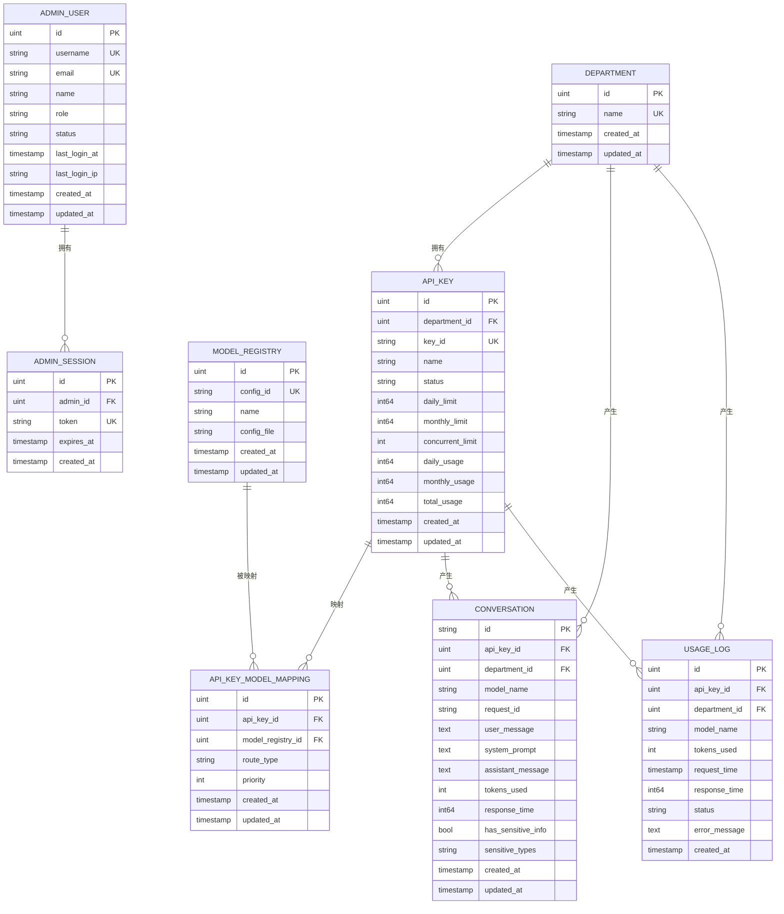
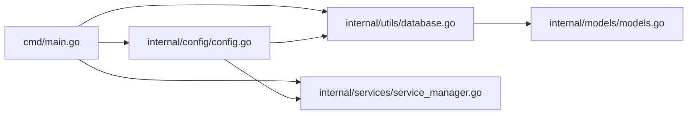

# 数据库管理

<cite>
**本文引用的文件列表**
- [database.go](file://internal/utils/database.go)
- [config.go](file://internal/config/config.go)
- [models.go](file://internal/models/models.go)
- [init_db.sh](file://scripts/init_db.sh)
- [mysql-init.sql](file://scripts/mysql-init.sql)
- [add_admin_tables.sql](file://migrations/add_admin_tables.sql)
- [config.mysql.yaml](file://configs/config.mysql.yaml)
- [config.postgres.yaml](file://configs/config.postgres.yaml)
- [docker-compose.yml](file://docker-compose.yml)
- [docker-compose.postgres.yml](file://docker-compose.postgres.yml)
- [main.go](file://cmd/main.go)
- [service_manager.go](file://internal/services/service_manager.go)
</cite>

## 目录
1. [简介](#简介)
2. [项目结构](#项目结构)
3. [核心组件](#核心组件)
4. [架构总览](#架构总览)
5. [详细组件分析](#详细组件分析)
6. [依赖分析](#依赖分析)
7. [性能考虑](#性能考虑)
8. [故障排查指南](#故障排查指南)
9. [结论](#结论)
10. [附录](#附录)

## 简介
本文件面向 Wolink-Core 的数据库管理，围绕以下目标展开：
- 解释数据库初始化脚本的执行流程与表结构设计
- 说明数据库迁移机制（版本控制、回滚策略与数据一致性）
- 提供数据库备份与恢复流程（全量与增量策略）
- 给出性能优化、索引与查询优化最佳实践
- 对比 MySQL 与 PostgreSQL 的配置差异与迁移注意事项
- 提供监控、故障排查与容量规划的实用指南

## 项目结构
Wolink-Core 的数据库相关能力主要分布在如下模块：
- 配置层：定义数据库、Redis、连接池等配置项
- 初始化层：根据配置建立数据库连接、自动迁移模型、初始化 Redis
- 模型层：定义业务表结构及索引
- 迁移层：提供 SQL 迁移脚本
- 脚本层：提供初始化数据库与容器编排
- 应用入口：在启动阶段完成数据库与 Redis 初始化

图表来源
- [main.go:19-89](file://cmd/main.go#L19-L89)
- [config.go:96-184](file://internal/config/config.go#L96-L184)
- [database.go:73-122](file://internal/utils/database.go#L73-L122)
- [models.go:10-160](file://internal/models/models.go#L10-L160)
- [init_db.sh:1-46](file://scripts/init_db.sh#L1-L46)
- [mysql-init.sql:1-32](file://scripts/mysql-init.sql#L1-L32)
- [docker-compose.yml:1-59](file://docker-compose.yml#L1-L59)
- [docker-compose.postgres.yml:1-55](file://docker-compose.postgres.yml#L1-L55)

章节来源
- [main.go:19-89](file://cmd/main.go#L19-L89)
- [config.go:96-184](file://internal/config/config.go#L96-L184)
- [database.go:73-122](file://internal/utils/database.go#L73-L122)
- [models.go:10-160](file://internal/models/models.go#L10-L160)
- [init_db.sh:1-46](file://scripts/init_db.sh#L1-L46)
- [mysql-init.sql:1-32](file://scripts/mysql-init.sql#L1-L32)
- [docker-compose.yml:1-59](file://docker-compose.yml#L1-L59)
- [docker-compose.postgres.yml:1-55](file://docker-compose.postgres.yml#L1-L55)

## 核心组件
- 数据库初始化与连接池配置
  - 支持 MySQL、PostgreSQL、SQLite 三种驱动
  - 通过 GORM 打开连接并设置静默日志级别
  - 连接池参数可按需覆盖（最大并发、空闲连接、生命周期）
- GORM 自动迁移
  - 在初始化时对部门、API 密钥、模型注册、对话、用量日志等模型进行自动迁移
- Redis 初始化与连接测试
  - 构建 Redis 选项并进行 Ping 测试
- 配置体系
  - 通过 YAML 文件与环境变量加载配置，支持默认值与基础设施超时、连接池等参数

章节来源
- [database.go:19-42](file://internal/utils/database.go#L19-L42)
- [database.go:73-122](file://internal/utils/database.go#L73-L122)
- [database.go:124-139](file://internal/utils/database.go#L124-L139)
- [config.go:33-47](file://internal/config/config.go#L33-L47)
- [config.go:54-65](file://internal/config/config.go#L54-L65)

## 架构总览
下图展示应用启动时数据库与 Redis 的初始化流程，以及与业务服务的关系。

图表来源
- [main.go:19-89](file://cmd/main.go#L19-L89)
- [config.go:96-184](file://internal/config/config.go#L96-L184)
- [database.go:73-122](file://internal/utils/database.go#L73-L122)
- [models.go:10-160](file://internal/models/models.go#L10-L160)
- [service_manager.go:30-62](file://internal/services/service_manager.go#L30-L62)

## 详细组件分析

### 数据库初始化与连接池
- 初始化流程
  - 根据配置选择数据库类型，构造 DSN 并打开连接
  - 设置 GORM 日志级别为静默
  - 应用连接池配置（最大并发、空闲连接、生命周期）
  - 执行自动迁移，涵盖部门、API 密钥、模型映射、对话、用量日志等
- 连接池配置项
  - 最大打开连接数、最大空闲连接数、连接最大生命周期、空闲连接最大存活时间
- 错误处理
  - 获取底层 sql.DB 失败、连接失败、连接池配置失败、迁移失败均返回错误

图表来源
- [database.go:73-122](file://internal/utils/database.go#L73-L122)

章节来源
- [database.go:19-42](file://internal/utils/database.go#L19-L42)
- [database.go:73-122](file://internal/utils/database.go#L73-L122)
- [config.go:33-39](file://internal/config/config.go#L33-L39)

### GORM 自动迁移与模型设计
- 自动迁移对象
  - 部门、API 密钥、模型注册、API 密钥-模型映射、对话、用量日志
- 关键字段与约束
  - 主键、唯一索引、普通索引、外键、枚举类型、默认值、时间戳
- 业务模型概览
  - 部门与 API 密钥：一对多关系，用于权限与配额控制
  - API 密钥-模型映射：多对多关系的桥接表，含路由类型与优先级
  - 对话：UUID 主键，包含请求/响应内容、令牌用量、响应时间、敏感信息标记
  - 用量日志：异步记录，包含令牌用量、请求时间、状态与错误信息
  - 管理员用户与会话：用于后台管理认证与会话管理

图表来源
- [models.go:10-160](file://internal/models/models.go#L10-L160)

章节来源
- [models.go:10-160](file://internal/models/models.go#L10-L160)
- [database.go:109-119](file://internal/utils/database.go#L109-L119)

### 管理员表结构与迁移
- 管理员用户表
  - 字段：用户名、密码哈希、邮箱、姓名、角色、状态、最后登录时间与 IP、创建/更新时间
  - 索引：用户名、邮箱、状态、角色
- 管理员会话表
  - 字段：管理员 ID、Token 哈希、过期时间、创建时间
  - 索引：管理员 ID、Token、过期时间；外键关联管理员用户
- 初始数据
  - 插入默认超级管理员账户（用户名、密码哈希）

章节来源
- [add_admin_tables.sql:1-38](file://migrations/add_admin_tables.sql#L1-L38)

### 初始化脚本与容器编排
- 初始化脚本
  - 支持 MySQL 与 PostgreSQL，默认创建数据库并输出连接信息
- MySQL 初始化 SQL
  - 设置字符集、创建数据库、设置 sql_mode、预留索引注释与示例
- 容器编排
  - docker-compose.yml：默认 MySQL，挂载初始化 SQL
  - docker-compose.postgres.yml：PostgreSQL 配置

章节来源
- [init_db.sh:1-46](file://scripts/init_db.sh#L1-L46)
- [mysql-init.sql:1-32](file://scripts/mysql-init.sql#L1-L32)
- [docker-compose.yml:1-59](file://docker-compose.yml#L1-L59)
- [docker-compose.postgres.yml:1-55](file://docker-compose.postgres.yml#L1-L55)

### 配置差异（MySQL vs PostgreSQL）
- 数据库类型
  - MySQL：type=mysql
  - PostgreSQL：type=postgres 或 postgresql
- 连接参数
  - MySQL：host、port、user、password、dbname、charset、parsetime、loc
  - PostgreSQL：host、port、user、password、dbname、sslmode
- 默认端口
  - MySQL：3306
  - PostgreSQL：5432
- SSL 模式
  - MySQL：charset 与解析时间参数
  - PostgreSQL：sslmode 控制 SSL

章节来源
- [config.mysql.yaml:5-14](file://configs/config.mysql.yaml#L5-L14)
- [config.postgres.yaml:5-12](file://configs/config.postgres.yaml#L5-L12)
- [config.go:54-65](file://internal/config/config.go#L54-L65)

## 依赖分析
- 启动顺序依赖
  - 配置加载 → 数据库初始化 → Redis 初始化 → 服务管理器构建
- 组件耦合
  - ServiceManager 持有 DB 与 Redis 客户端，各业务服务通过它访问数据层
- 外部依赖
  - GORM（MySQL/PostgreSQL/SQLite 驱动）、go-redis、Viper 配置加载

图表来源
- [main.go:19-89](file://cmd/main.go#L19-L89)
- [config.go:96-184](file://internal/config/config.go#L96-L184)
- [database.go:73-122](file://internal/utils/database.go#L73-L122)
- [service_manager.go:30-62](file://internal/services/service_manager.go#L30-L62)

章节来源
- [main.go:19-89](file://cmd/main.go#L19-L89)
- [service_manager.go:30-62](file://internal/services/service_manager.go#L30-L62)

## 性能考虑
- 连接池优化
  - 合理设置最大打开连接数与空闲连接数，避免过高导致资源争用，过低导致频繁创建
  - 控制连接最大生命周期，防止长时间连接带来的内存泄漏与锁竞争
- 索引策略
  - 已有索引：对话表创建时间、用量日志表 APIKey/部门、模型名、请求时间等
  - 建议补充：按业务查询热点增加复合索引（如按部门+创建时间、按 APIKey+创建时间）
- 查询优化
  - 使用分页与条件过滤，避免 SELECT *
  - 对高频聚合查询（用量统计）建议物化视图或定期汇总表
- 缓存与异步
  - 用量日志采用异步写入，降低主路径延迟
  - Redis 作为缓存与会话存储，注意键空间淘汰策略与过期时间
- 字符集与排序规则
  - MySQL 使用 utf8mb4 与统一排序规则，确保多语言与表情兼容性

[本节为通用性能建议，无需特定文件引用]

## 故障排查指南
- 连接失败
  - 检查数据库类型、主机、端口、用户名、密码、数据库名是否正确
  - 确认网络连通性与防火墙策略
- 迁移失败
  - 查看自动迁移报错，确认模型字段与现有表结构兼容
  - 如需手动迁移，先备份再执行 SQL 脚本
- 连接池问题
  - 观察最大连接数与空闲连接数是否合理，适当调整
  - 检查连接生命周期设置，避免连接老化
- Redis 连接异常
  - 确认 Redis 地址、端口、密码、DB 号
  - 使用 PING 测试连通性
- 容器启动失败
  - 查看健康检查日志，确认数据库初始化脚本执行成功
  - 检查卷挂载与权限

章节来源
- [database.go:19-42](file://internal/utils/database.go#L19-L42)
- [database.go:73-122](file://internal/utils/database.go#L73-L122)
- [docker-compose.yml:39-43](file://docker-compose.yml#L39-L43)
- [docker-compose.postgres.yml:35-39](file://docker-compose.postgres.yml#L35-L39)

## 结论
Wolink-Core 的数据库管理以 GORM 为核心，结合 Viper 配置与连接池，实现了对 MySQL、PostgreSQL、SQLite 的统一接入。通过自动迁移与明确的模型设计，保障了业务表结构的一致性。配合初始化脚本与容器编排，能够快速搭建开发与生产环境。后续可在索引、查询与缓存方面进一步优化，并完善备份与容量规划策略。

[本节为总结，无需特定文件引用]

## 附录

### 数据库初始化脚本执行流程
- 脚本选择
  - MySQL：创建数据库、设置字符集与排序规则、设置 sql_mode
  - PostgreSQL：创建数据库、列出数据库
- 容器内初始化
  - MySQL 容器启动时执行挂载的初始化 SQL
- 启动后迁移
  - 应用启动时执行 GORM 自动迁移，创建业务表与索引

章节来源
- [init_db.sh:10-42](file://scripts/init_db.sh#L10-L42)
- [mysql-init.sql:1-32](file://scripts/mysql-init.sql#L1-L32)
- [docker-compose.yml:38-43](file://docker-compose.yml#L38-L43)

### 数据库迁移机制与回滚策略
- 版本控制
  - 当前实现为 GORM 自动迁移，未内置版本号管理
  - 建议引入迁移工具（如 goose、flyway）维护版本号与变更集
- 回滚策略
  - GORM 自动迁移不提供回滚能力，建议通过备份与手工 SQL 恢复
- 数据一致性
  - 使用事务包裹关键写操作，确保原子性
  - 对外暴露的 API 层进行参数校验与幂等处理

章节来源
- [database.go:109-119](file://internal/utils/database.go#L109-L119)

### 备份与恢复流程
- 全量备份
  - MySQL：使用逻辑导出或物理快照
  - PostgreSQL：使用逻辑导出或物理快照
- 增量备份
  - MySQL：启用二进制日志并定期备份
  - PostgreSQL：启用 WAL 归档并定期备份
- 恢复验证
  - 在隔离环境中恢复并执行一致性检查
  - 验证业务表结构与关键数据完整性

[本节为通用流程建议，无需特定文件引用]

### MySQL 与 PostgreSQL 配置差异与迁移注意事项
- 差异点
  - 参数命名与默认值不同（charset/sslmode、parsetime/loc）
  - 端口不同（3306 vs 5432）
  - 驱动与 DSN 构造方式不同
- 迁移注意事项
  - 字符集与排序规则保持一致
  - 索引与数据类型差异需手工调整
  - 连接池参数与超时设置需分别配置

章节来源
- [config.mysql.yaml:5-14](file://configs/config.mysql.yaml#L5-L14)
- [config.postgres.yaml:5-12](file://configs/config.postgres.yaml#L5-L12)
- [database.go:81-95](file://internal/utils/database.go#L81-L95)

### 监控、故障排查与容量规划
- 监控指标
  - 数据库连接数、等待时间、慢查询、事务提交频率
  - Redis 内存使用、命中率、阻塞命令
- 故障排查
  - 通过日志与健康检查定位问题
  - 快速回滚到上一个稳定版本
- 容量规划
  - 基于对话量与用量日志增长趋势估算存储与 IO
  - 评估连接池上限与缓存命中率对资源的影响

[本节为通用指导，无需特定文件引用]