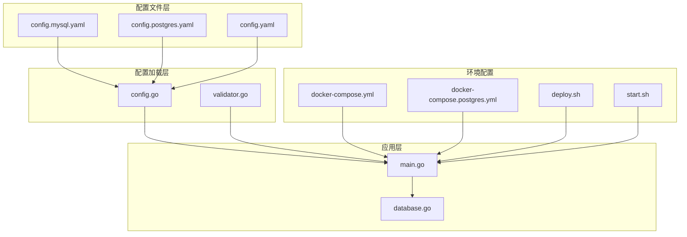
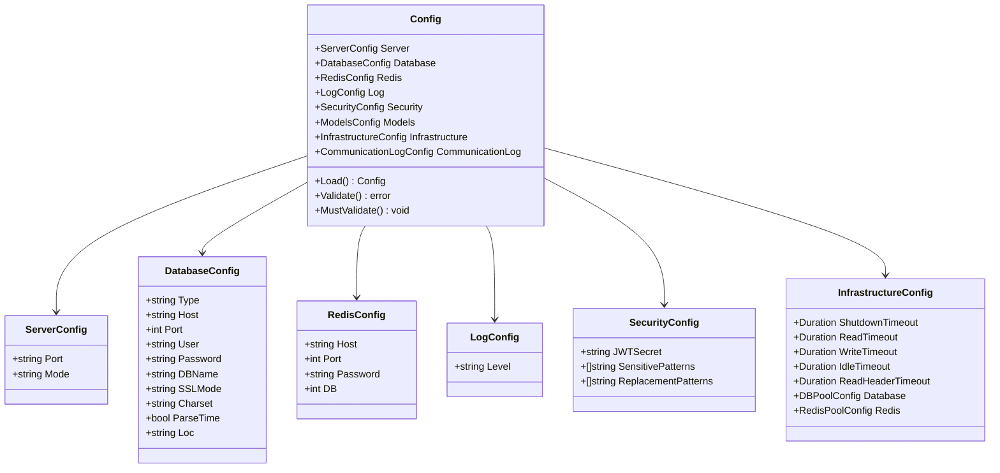
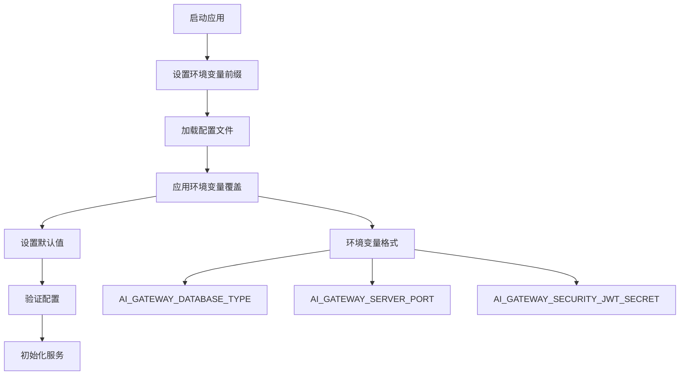
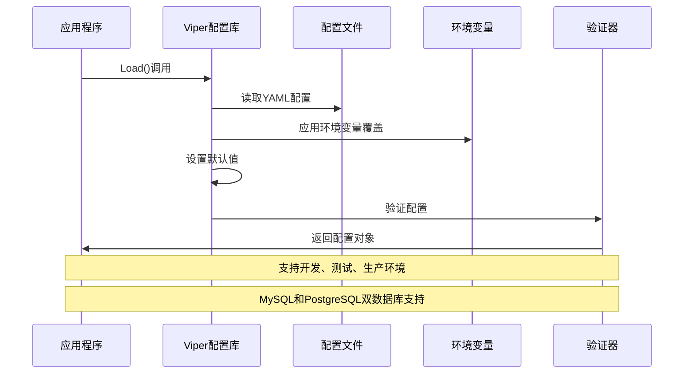
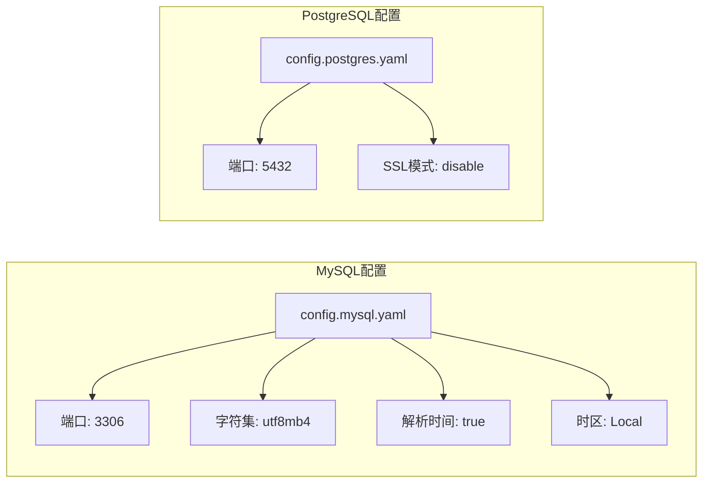
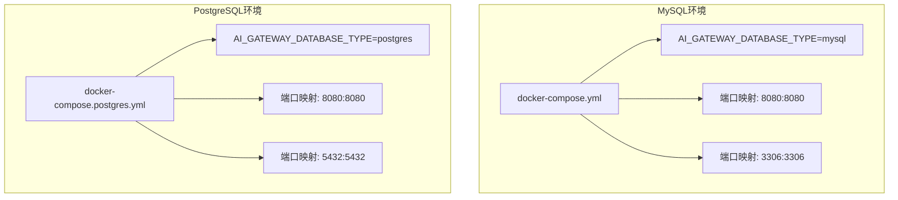
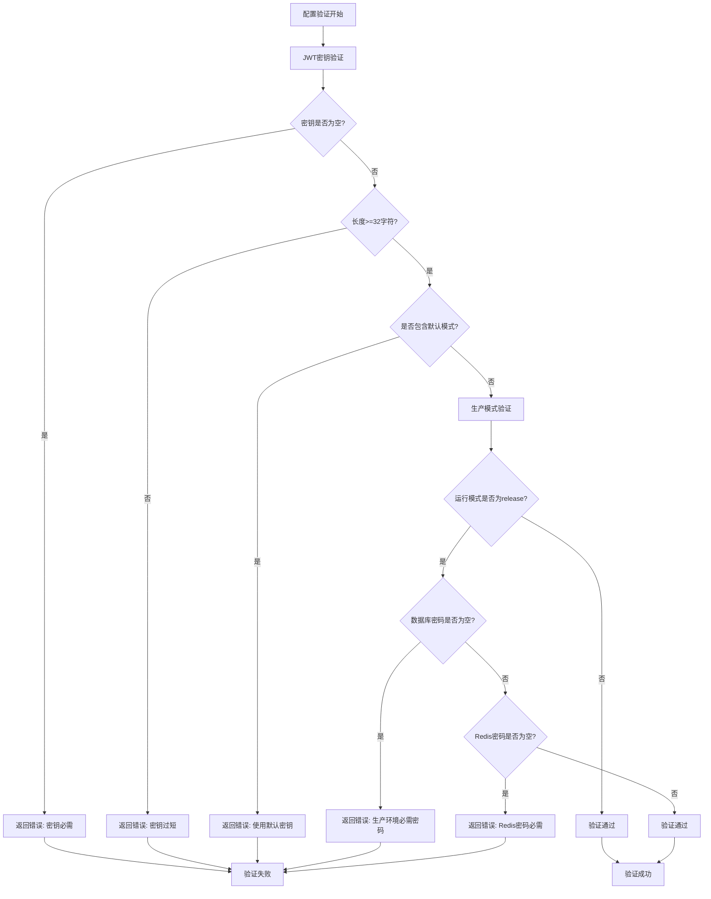
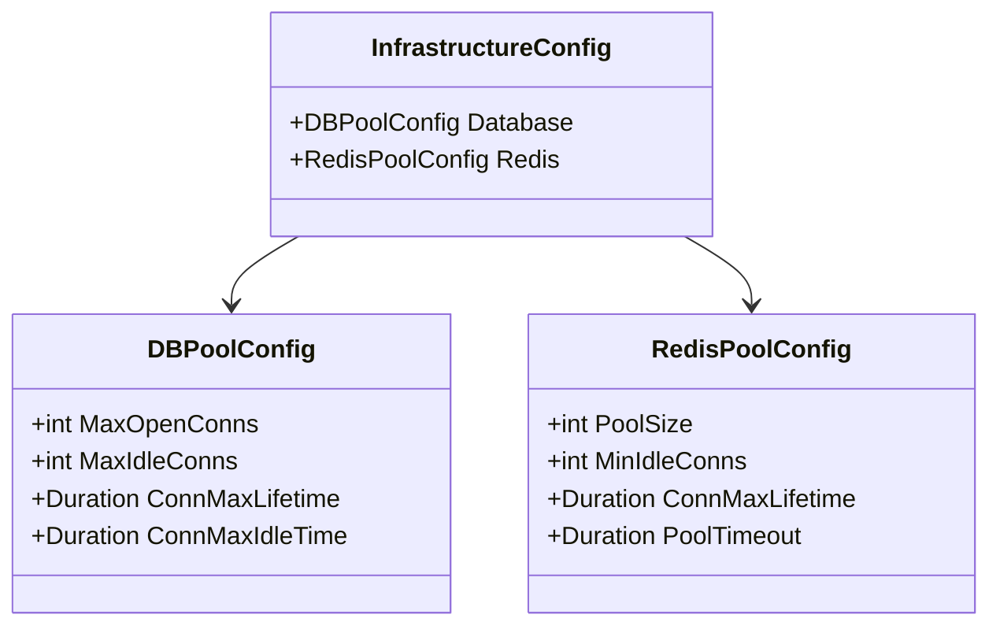
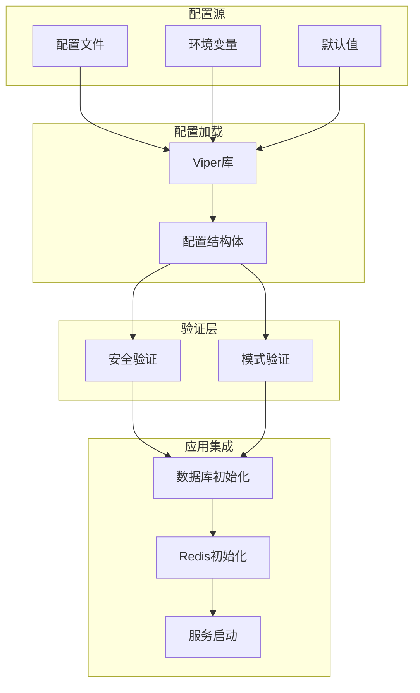
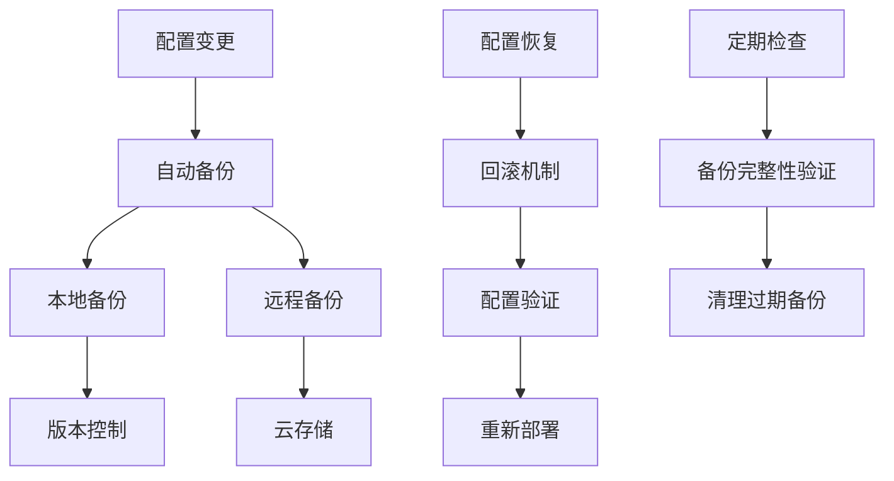

# 环境配置管理

<cite>
**本文档引用的文件**
- [config.go](file://internal/config/config.go)
- [validator.go](file://internal/config/validator.go)
- [main.go](file://cmd/main.go)
- [database.go](file://internal/utils/database.go)
- [config.mysql.yaml](file://configs/config.mysql.yaml)
- [config.postgres.yaml](file://configs/config.postgres.yaml)
- [docker-compose.yml](file://docker-compose.yml)
- [docker-compose.postgres.yml](file://docker-compose.postgres.yml)
- [deploy.sh](file://scripts/deploy.sh)
- [start.sh](file://scripts/start.sh)
- [logger.go](file://internal/observability/logger.go)
- [prometheus.yml](file://configs/prometheus.yml)
</cite>

## 目录
1. [简介](#简介)
2. [项目结构](#项目结构)
3. [核心组件](#核心组件)
4. [架构概览](#架构概览)
5. [详细组件分析](#详细组件分析)
6. [依赖关系分析](#依赖关系分析)
7. [性能考虑](#性能考虑)
8. [故障排除指南](#故障排除指南)
9. [结论](#结论)

## 简介

Wolink-Core 提供了完整的环境配置管理解决方案，支持多种运行环境（开发、测试、生产）和数据库类型（MySQL、PostgreSQL）。该系统采用 Viper 配置库实现配置文件读取、环境变量覆盖和配置验证，确保应用程序在不同环境中的一致性和安全性。

## 项目结构

Wolink-Core 的配置管理采用分层架构设计，主要包含以下结构：



**图表来源**
- [config.go:96-124](file://internal/config/config.go#L96-L124)
- [main.go:19-48](file://cmd/main.go#L19-L48)

**章节来源**
- [config.go:1-185](file://internal/config/config.go#L1-L185)
- [main.go:1-89](file://cmd/main.go#L1-L89)

## 核心组件

### 配置数据结构

系统定义了完整的配置数据结构，支持多环境配置管理：



**图表来源**
- [config.go:10-94](file://internal/config/config.go#L10-L94)

### 环境变量优先级机制

系统采用 Viper 实现环境变量与配置文件的优先级控制：



**图表来源**
- [config.go:96-124](file://internal/config/config.go#L96-L124)
- [config.go:102-104](file://internal/config/config.go#L102-L104)

**章节来源**
- [config.go:96-185](file://internal/config/config.go#L96-L185)

## 架构概览

### 配置加载流程



**图表来源**
- [config.go:96-124](file://internal/config/config.go#L96-L124)
- [validator.go:18-32](file://internal/config/validator.go#L18-L32)

### 数据库配置差异



**图表来源**
- [config.mysql.yaml:5-14](file://configs/config.mysql.yaml#L5-L14)
- [config.postgres.yaml:5-12](file://configs/config.postgres.yaml#L5-L12)

**章节来源**
- [config.mysql.yaml:1-37](file://configs/config.mysql.yaml#L1-L37)
- [config.postgres.yaml:1-35](file://configs/config.postgres.yaml#L1-L35)

## 详细组件分析

### 配置文件结构详解

#### MySQL 配置文件

MySQL 配置文件提供了完整的数据库连接参数：

| 参数名称 | 类型 | 默认值 | 描述 |
|---------|------|--------|------|
| server.port | string | "8080" | 服务器监听端口 |
| server.mode | string | "debug" | 运行模式（debug/test/release） |
| database.type | string | "mysql" | 数据库类型 |
| database.host | string | "localhost" | 数据库主机地址 |
| database.port | int | 3306 | MySQL端口号 |
| database.user | string | "root" | 数据库用户名 |
| database.password | string | "password" | 数据库密码 |
| database.dbname | string | "ai_gateway" | 数据库名称 |
| database.charset | string | "utf8mb4" | 字符集设置 |
| database.parsetime | bool | true | 是否解析时间 |
| database.loc | string | "Local" | 时区设置 |

#### PostgreSQL 配置文件

PostgreSQL 配置文件具有不同的默认参数：

| 参数名称 | 类型 | 默认值 | 描述 |
|---------|------|--------|------|
| server.port | string | "8080" | 服务器监听端口 |
| server.mode | string | "debug" | 运行模式 |
| database.type | string | "postgres" | 数据库类型 |
| database.host | string | "localhost" | 数据库主机地址 |
| database.port | int | 5432 | PostgreSQL端口号 |
| database.user | string | "postgres" | 数据库用户名 |
| database.password | string | "password" | 数据库密码 |
| database.dbname | string | "ai_gateway" | 数据库名称 |
| database.sslmode | string | "disable" | SSL连接模式 |

#### 安全配置

安全配置包含敏感信息处理和认证设置：

| 参数名称 | 类型 | 默认值 | 描述 |
|---------|------|--------|------|
| security.jwt_secret | string | "your-super-secret-jwt-key" | JWT密钥 |
| security.sensitive_patterns | []string | 手机号、身份证号、银行卡号正则表达式 | 敏感信息模式 |
| security.replacement_patterns | []string | "[PHONE]", "[ID_CARD]", "[BANK_CARD]" | 替换模式 |

**章节来源**
- [config.mysql.yaml:1-37](file://configs/config.mysql.yaml#L1-L37)
- [config.postgres.yaml:1-35](file://configs/config.postgres.yaml#L1-L35)

### 环境切换机制

#### Docker Compose 配置

系统提供了针对不同数据库的 Docker Compose 配置：



**图表来源**
- [docker-compose.yml:8-17](file://docker-compose.yml#L8-L17)
- [docker-compose.postgres.yml:8-17](file://docker-compose.postgres.yml#L8-L17)

#### 部署脚本自动化

部署脚本支持一键切换数据库类型：

| 操作命令 | 功能描述 | 使用场景 |
|---------|----------|----------|
| `./scripts/deploy.sh mysql up` | 启动MySQL环境 | 开发测试 |
| `./scripts/deploy.sh postgres up` | 启动PostgreSQL环境 | 生产环境 |
| `./scripts/deploy.sh mysql down` | 停止MySQL环境 | 环境清理 |
| `./scripts/deploy.sh postgres logs` | 查看PostgreSQL日志 | 问题诊断 |

**章节来源**
- [docker-compose.yml:1-59](file://docker-compose.yml#L1-L59)
- [docker-compose.postgres.yml:1-55](file://docker-compose.postgres.yml#L1-L55)
- [deploy.sh:1-61](file://scripts/deploy.sh#L1-L61)

### 配置验证机制

#### 安全验证规则

系统实现了多层次的安全验证：



**图表来源**
- [validator.go:18-77](file://internal/config/validator.go#L18-L77)

#### 验证规则详情

| 验证规则 | 条件要求 | 错误信息 | 触发条件 |
|---------|----------|----------|----------|
| JWT密钥长度 | >=32字符 | "JWT secret must be at least 32 characters" | 任何模式 |
| 默认密钥检测 | 不包含knownDefaultPatterns | "JWT secret is a default or insecure value" | 任何模式 |
| 生产模式数据库密码 | 必需非空 | "database password is required in production mode" | server.mode=release |
| 生产模式Redis密码 | 必需非空 | "redis password is required in production mode" | server.mode=release |

**章节来源**
- [validator.go:9-16](file://internal/config/validator.go#L9-L16)
- [validator.go:18-77](file://internal/config/validator.go#L18-L77)

### 数据库连接池配置

#### 连接池参数详解



**图表来源**
- [config.go:33-47](file://internal/config/config.go#L33-L47)

#### 默认连接池配置

| 组件 | 参数 | 默认值 | 作用 |
|------|------|--------|------|
| 数据库连接池 | MaxOpenConns | 25 | 最大打开连接数 |
| 数据库连接池 | MaxIdleConns | 10 | 最大空闲连接数 |
| 数据库连接池 | ConnMaxLifetime | 5分钟 | 连接最大生命周期 |
| Redis连接池 | PoolSize | 20 | 连接池大小 |
| Redis连接池 | MinIdleConns | 5 | 最小空闲连接数 |
| Redis连接池 | ConnMaxLifetime | 5分钟 | 连接最大生命周期 |

**章节来源**
- [config.go:175-183](file://internal/config/config.go#L175-L183)

## 依赖关系分析

### 配置依赖图



**图表来源**
- [config.go:96-124](file://internal/config/config.go#L96-L124)
- [main.go:29-42](file://cmd/main.go#L29-L42)

### 外部依赖

系统依赖的关键外部组件：

| 组件 | 版本 | 用途 | 配置影响 |
|------|------|------|----------|
| Viper | ^1.16.0 | 配置管理 | 环境变量覆盖、配置文件读取 |
| GORM | ^1.25.0 | ORM框架 | 数据库连接、自动迁移 |
| go-redis | ^8.0.0 | Redis客户端 | 缓存连接、连接池管理 |
| Gin | ^1.9.0 | Web框架 | 服务器配置、路由管理 |
| Logrus | ^1.9.0 | 日志记录 | 日志级别、格式化输出 |

**章节来源**
- [main.go:3-17](file://cmd/main.go#L3-L17)
- [database.go:3-17](file://internal/utils/database.go#L3-L17)

## 性能考虑

### 连接池优化

系统提供了灵活的连接池配置选项：

1. **数据库连接池优化**
   - 可根据负载调整 MaxOpenConns 和 MaxIdleConns
   - 合理设置 ConnMaxLifetime 防止连接泄漏
   - 在高并发场景下适当增加连接池大小

2. **Redis连接池优化**
   - 根据请求量调整 PoolSize
   - 设置合适的 MinIdleConns 保证响应速度
   - 配置 PoolTimeout 处理连接超时情况

3. **基础设施超时配置**
   - ReadTimeout: 15秒（默认）
   - WriteTimeout: 30秒（默认）
   - IdleTimeout: 120秒（默认）
   - ShutdownTimeout: 30秒（默认）

### 监控集成

系统支持 Prometheus 监控集成：

```mermaid
flowchart LR
A[应用服务] --> B[/metrics端点]
B --> C[Prometheus抓取]
C --> D[指标存储]
D --> E[可视化展示]
F[配置文件] --> G[prometheus.yml]
G --> C
```

**图表来源**
- [prometheus.yml:1-10](file://configs/prometheus.yml#L1-L10)

## 故障排除指南

### 常见配置问题

#### 数据库连接问题

| 问题症状 | 可能原因 | 解决方案 |
|----------|----------|----------|
| 连接超时 | 网络延迟或防火墙 | 检查网络连通性，调整超时设置 |
| 认证失败 | 用户名或密码错误 | 验证凭据，检查用户权限 |
| 数据库不存在 | 数据库名称错误 | 确认数据库存在，创建缺失数据库 |
| 字符集问题 | 字符集不匹配 | 设置正确的字符集参数 |

#### 配置验证错误

| 错误信息 | 原因 | 解决方法 |
|----------|------|----------|
| "JWT secret is required" | 未设置JWT密钥 | 生成强密码并设置环境变量 |
| "database password is required in production mode" | 生产环境缺少数据库密码 | 设置数据库密码 |
| "redis password is required in production mode" | 生产环境缺少Redis密码 | 设置Redis密码 |
| "unsupported database type" | 数据库类型不支持 | 使用mysql或postgres |

#### 环境变量配置

确保正确设置环境变量前缀：

```bash
# 设置环境变量前缀
export AI_GATEWAY_SERVER_MODE=release
export AI_GATEWAY_DATABASE_TYPE=mysql
export AI_GATEWAY_SECURITY_JWT_SECRET=your-secure-secret-key
```

**章节来源**
- [validator.go:18-77](file://internal/config/validator.go#L18-L77)
- [database.go:77-95](file://internal/utils/database.go#L77-L95)

### 配置热更新方案

虽然当前实现不支持配置热更新，但可以采用以下策略：

1. **容器编排方式**
   - 使用 Docker Compose 更新配置文件后重启容器
   - 通过环境变量动态切换数据库类型

2. **配置文件监控**
   - 实现文件监控机制，检测配置文件变化
   - 在检测到变化时触发优雅重启

3. **外部配置中心**
   - 集成 Consul、etcd 等配置中心
   - 实现配置的集中管理和动态更新

### 配置备份策略



## 结论

Wolink-Core 的环境配置管理系统提供了完整的企业级配置管理能力：

### 主要优势

1. **多环境支持**：完美支持开发、测试、生产三种环境
2. **双数据库兼容**：同时支持 MySQL 和 PostgreSQL
3. **安全验证**：内置多层次安全验证机制
4. **灵活配置**：支持环境变量覆盖和默认值设置
5. **容器化部署**：提供完整的 Docker 配置和部署脚本

### 最佳实践建议

1. **生产环境配置**
   - 使用 release 模式
   - 设置强密码和安全的 JWT 密钥
   - 配置适当的连接池参数

2. **开发环境配置**
   - 使用 debug 模式便于调试
   - 可以使用默认的测试凭据
   - 启用详细的日志输出

3. **监控和维护**
   - 定期检查配置文件的完整性
   - 建立配置变更的审计机制
   - 制定配置备份和恢复策略

该配置管理系统为企业级应用提供了可靠的基础设施，确保应用程序在不同环境中的稳定运行和安全管理。