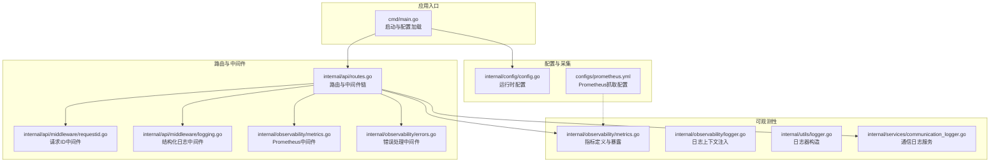
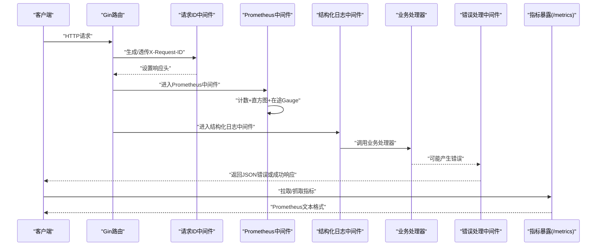
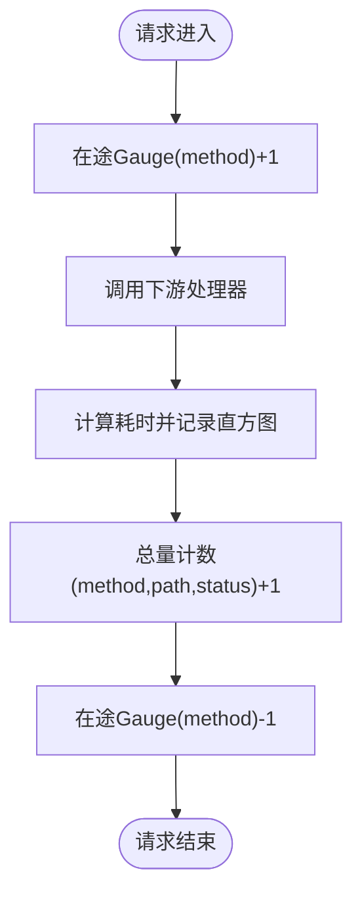
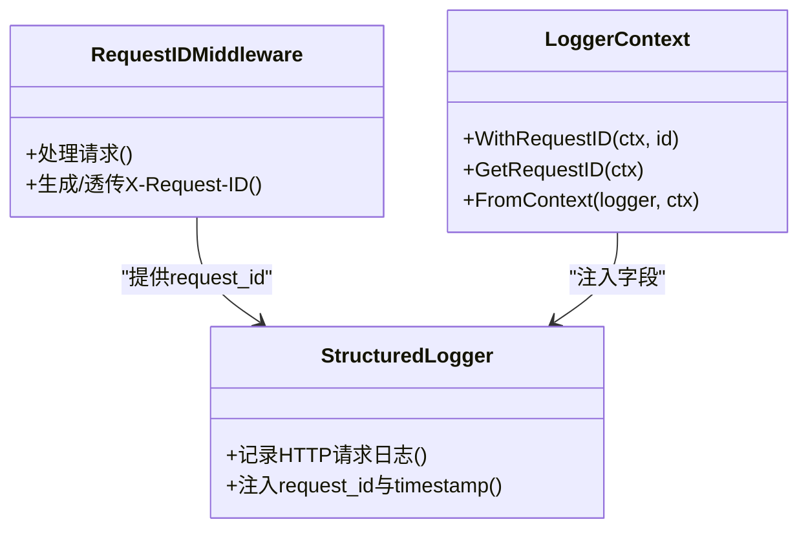
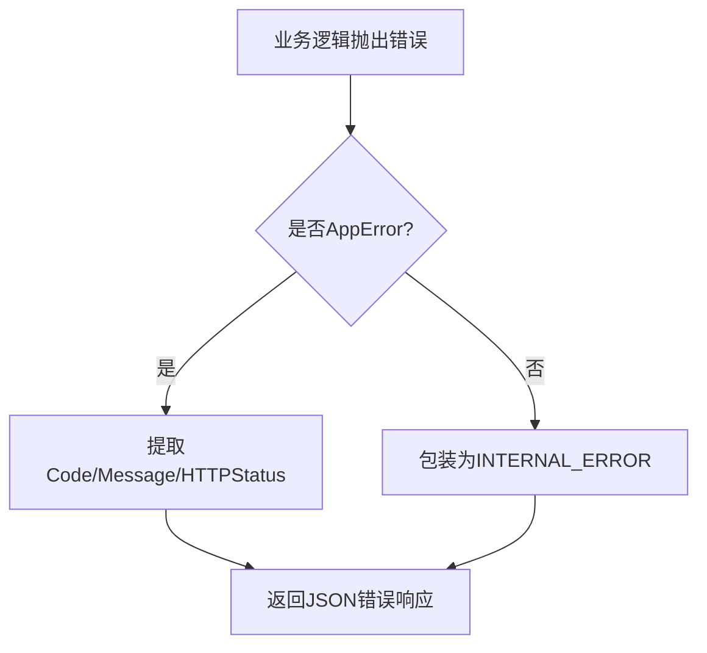
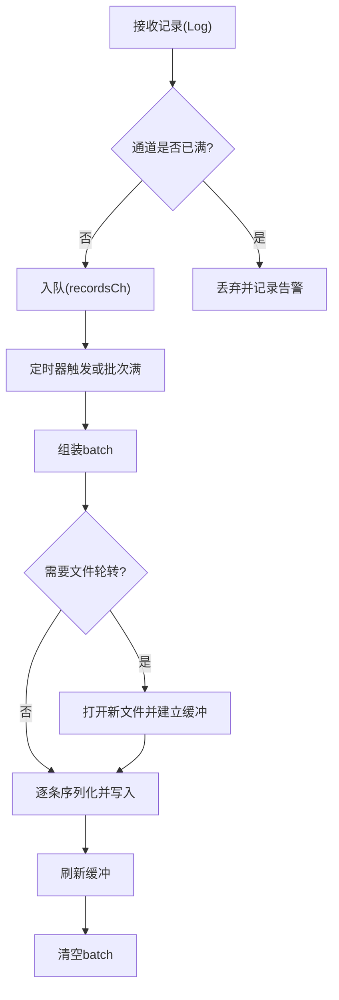
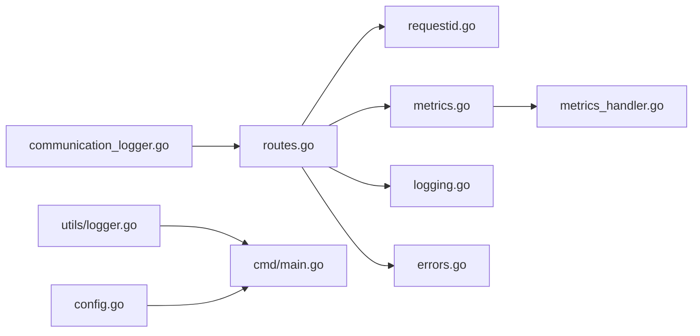

# 监控与日志

<cite>
**本文引用的文件**
- [cmd/main.go](file://cmd/main.go)
- [configs/prometheus.yml](file://configs/prometheus.yml)
- [internal/config/config.go](file://internal/config/config.go)
- [internal/api/routes.go](file://internal/api/routes.go)
- [internal/observability/metrics.go](file://internal/observability/metrics.go)
- [internal/observability/logger.go](file://internal/observability/logger.go)
- [internal/observability/errors.go](file://internal/observability/errors.go)
- [internal/api/middleware/logging.go](file://internal/api/middleware/logging.go)
- [internal/api/middleware/requestid.go](file://internal/api/middleware/requestid.go)
- [internal/api/handlers/metrics_handler.go](file://internal/api/handlers/metrics_handler.go)
- [internal/utils/logger.go](file://internal/utils/logger.go)
- [internal/services/communication_logger.go](file://internal/services/communication_logger.go)
- [internal/observability/metrics_test.go](file://internal/observability/metrics_test.go)
- [internal/observability/logger_test.go](file://internal/observability/logger_test.go)
- [internal/api/middleware/logging_test.go](file://internal/api/middleware/logging_test.go)
</cite>

## 目录
1. [简介](#简介)
2. [项目结构](#项目结构)
3. [核心组件](#核心组件)
4. [架构总览](#架构总览)
5. [详细组件分析](#详细组件分析)
6. [依赖分析](#依赖分析)
7. [性能考虑](#性能考虑)
8. [故障排查指南](#故障排查指南)
9. [结论](#结论)
10. [附录](#附录)

## 简介
本文件为 Wolink-Core 的监控与日志系统提供全面的技术文档，覆盖以下方面：
- Prometheus 监控指标的定义与采集配置，含自定义指标与第三方集成要点
- 结构化日志实现原理与日志级别管理
- 日志聚合、分析与告警的端到端方案
- 系统性能监控、业务指标监控与错误追踪最佳实践
- 监控仪表板搭建与关键指标解读方法
- 故障排查的监控工具使用指南与常见问题诊断

## 项目结构
Wolink-Core 将监控与日志能力以“可观测性模块”和“中间件/处理器”的形式嵌入到应用启动与路由层中：
- 应用入口负责加载配置、初始化日志、构建路由并启动 HTTP 服务器
- 路由层按顺序挂载恢复、请求 ID、Prometheus 指标、结构化日志、CORS、错误处理等中间件
- 可观测性模块提供 Prometheus 指标注册与暴露、结构化日志上下文注入、统一错误类型与响应
- 通信日志服务提供异步、批量、带轮转的 JSONL 文件记录能力

图表来源
- [cmd/main.go:19-89](file://cmd/main.go#L19-L89)
- [internal/api/routes.go:14-129](file://internal/api/routes.go#L14-L129)
- [internal/observability/metrics.go:12-93](file://internal/observability/metrics.go#L12-L93)
- [internal/observability/logger.go:10-43](file://internal/observability/logger.go#L10-L43)
- [internal/api/middleware/logging.go:10-52](file://internal/api/middleware/logging.go#L10-L52)
- [internal/api/middleware/requestid.go:11-40](file://internal/api/middleware/requestid.go#L11-L40)
- [internal/utils/logger.go:9-30](file://internal/utils/logger.go#L9-L30)
- [internal/services/communication_logger.go:31-272](file://internal/services/communication_logger.go#L31-L272)
- [internal/config/config.go:96-185](file://internal/config/config.go#L96-L185)
- [configs/prometheus.yml:1-10](file://configs/prometheus.yml#L1-L10)

章节来源
- [cmd/main.go:19-89](file://cmd/main.go#L19-L89)
- [internal/api/routes.go:14-129](file://internal/api/routes.go#L14-L129)
- [configs/prometheus.yml:1-10](file://configs/prometheus.yml#L1-L10)

## 核心组件
- 请求 ID 中间件：生成或透传 X-Request-ID，并在响应头回传，便于跨系统关联
- Prometheus 中间件：对每个请求进行计数、延迟直方图与“正在处理中的请求数”三类指标统计
- 结构化日志中间件：基于 logrus 输出 JSON，自动注入时间戳、请求 ID、方法、路径、状态码、耗时、客户端 IP 等字段
- 统一错误处理：将业务错误映射为标准 JSON 错误响应，支持预定义错误类型与自定义错误包装
- 通信日志服务：异步批量写入 JSONL 文件，按小时轮转，支持通道背压丢弃策略
- 日志器构造：根据配置动态设置日志级别，输出为 JSON 格式

章节来源
- [internal/api/middleware/requestid.go:11-40](file://internal/api/middleware/requestid.go#L11-L40)
- [internal/observability/metrics.go:53-93](file://internal/observability/metrics.go#L53-L93)
- [internal/api/middleware/logging.go:10-52](file://internal/api/middleware/logging.go#L10-L52)
- [internal/observability/errors.go:103-143](file://internal/observability/errors.go#L103-L143)
- [internal/services/communication_logger.go:31-272](file://internal/services/communication_logger.go#L31-L272)
- [internal/utils/logger.go:9-30](file://internal/utils/logger.go#L9-L30)

## 架构总览
下图展示从请求进入至指标暴露与日志输出的关键流程，以及与 Prometheus 的交互。

图表来源
- [internal/api/routes.go:17-29](file://internal/api/routes.go#L17-L29)
- [internal/observability/metrics.go:53-93](file://internal/observability/metrics.go#L53-L93)
- [internal/api/middleware/logging.go:22-52](file://internal/api/middleware/logging.go#L22-L52)
- [internal/observability/errors.go:114-142](file://internal/observability/errors.go#L114-L142)
- [internal/api/handlers/metrics_handler.go:18-22](file://internal/api/handlers/metrics_handler.go#L18-L22)

## 详细组件分析

### Prometheus 指标体系与采集
- 指标定义
  - http_requests_total：总量计数，标签包含 method、path（使用 FullPath 避免高基数）、status
  - http_request_duration_seconds：延迟直方图，标签 method、path，桶范围针对 API 延迟优化
  - http_requests_in_flight：在途请求数，标签 method
- 中间件行为
  - 在请求开始时增加在途 Gauge，在 defer 中减少，避免并发问题
  - 记录请求耗时并观察到直方图
  - 使用 c.FullPath() 作为 path 标签，确保不同参数值不导致标签爆炸
- 指标暴露
  - 提供 /metrics 端点，通过 gin.WrapH(promhttp.Handler()) 暴露 Prometheus 文本格式
- 采集配置
  - 示例配置文件指定抓取目标为 localhost:8080，路径 /metrics，抓取间隔 5 秒

图表来源
- [internal/observability/metrics.go:62-86](file://internal/observability/metrics.go#L62-L86)

章节来源
- [internal/observability/metrics.go:12-93](file://internal/observability/metrics.go#L12-L93)
- [internal/api/handlers/metrics_handler.go:18-22](file://internal/api/handlers/metrics_handler.go#L18-L22)
- [configs/prometheus.yml:5-10](file://configs/prometheus.yml#L5-L10)

### 结构化日志与请求追踪
- 请求 ID 注入
  - 上下文键值存储 request_id，支持从 context 获取
  - 日志条目自动包含 timestamp 与 request_id（若存在）
- HTTP 请求日志
  - 自动记录 method、path、status、latency_ms、client_ip
  - 通过响应头回传 X-Request-ID，便于跨系统追踪
- 日志器构造
  - 支持 debug/info/warn/error 级别，输出 JSON 格式，时间戳格式可配置

图表来源
- [internal/api/middleware/requestid.go:21-39](file://internal/api/middleware/requestid.go#L21-L39)
- [internal/api/middleware/logging.go:22-52](file://internal/api/middleware/logging.go#L22-L52)
- [internal/observability/logger.go:16-42](file://internal/observability/logger.go#L16-L42)

章节来源
- [internal/observability/logger.go:10-43](file://internal/observability/logger.go#L10-L43)
- [internal/api/middleware/logging.go:10-52](file://internal/api/middleware/logging.go#L10-L52)
- [internal/api/middleware/requestid.go:11-40](file://internal/api/middleware/requestid.go#L11-L40)
- [internal/utils/logger.go:9-30](file://internal/utils/logger.go#L9-L30)

### 统一错误处理与业务指标
- 错误类型
  - AppError：包含机器可读 code、人类可读 message、HTTP 状态码、可选 Cause
  - 预定义错误：UNAUTHORIZED/FORBIDDEN/NOT_FOUND/BAD_REQUEST/RATE_LIMITED/INTERNAL_ERROR
  - 工具函数：NewValidationError、NewServiceError
- 错误处理中间件
  - 捕获上下文中的错误，识别 AppError 并返回标准化 JSON
  - 非 AppError 回退为 INTERNAL_ERROR
- 业务指标建议
  - 可扩展在 Prometheus 中间件或业务处理器中增加自定义指标，如：
    - 按模型/部门/状态码的总量与错误率
    - 流式响应与非流式的区分计数
    - Token 使用量分布（结合业务侧统计）

图表来源
- [internal/observability/errors.go:103-142](file://internal/observability/errors.go#L103-L142)

章节来源
- [internal/observability/errors.go:10-143](file://internal/observability/errors.go#L10-L143)

### 通信日志服务
- 设计目标
  - 异步、非阻塞地记录 LLM 通信，避免影响主请求路径
  - 批量写入与定时刷新，降低磁盘 IO
  - 按小时轮转文件，控制单文件大小
- 关键特性
  - 通道容量与背压：满则丢弃并记录告警
  - 批量刷写：达到 batchSize 或定时器触发
  - 文件轮转：按小时切分，带缓冲写入
  - 优雅关闭：等待后台工作 goroutine 完成并落盘

图表来源
- [internal/services/communication_logger.go:79-203](file://internal/services/communication_logger.go#L79-L203)

章节来源
- [internal/services/communication_logger.go:31-272](file://internal/services/communication_logger.go#L31-L272)

### 应用启动与配置集成
- 启动流程
  - 加载配置（含日志级别、服务器端口、超时、数据库/Redis 连接等）
  - 构造日志器（JSON 输出、按配置级别）
  - 初始化数据库与 Redis
  - 构建路由并挂载中间件链
  - 启动 HTTP 服务器，监听系统信号并优雅关闭
- 配置要点
  - 日志级别：log.level 控制
  - 服务器端口：server.port
  - 超时与连接池：infrastructure.* 与 database_pool/redis_pool
  - 通信日志：communication_log.* 开关与路径

章节来源
- [cmd/main.go:19-89](file://cmd/main.go#L19-L89)
- [internal/config/config.go:96-185](file://internal/config/config.go#L96-L185)

## 依赖分析
- 组件耦合
  - 路由层对中间件链强依赖，顺序决定可观测性数据的完整性
  - Prometheus 中间件与指标暴露处理器解耦，便于独立部署与抓取
  - 通信日志服务与业务处理器弱耦合，通过非阻塞通道解耦
- 外部依赖
  - Gin：路由与中间件框架
  - Prometheus Go 客户端：指标定义与暴露
  - Logrus：结构化日志输出
  - Viper：配置加载与默认值

图表来源
- [internal/api/routes.go:14-129](file://internal/api/routes.go#L14-L129)
- [internal/observability/metrics.go:88-93](file://internal/observability/metrics.go#L88-L93)
- [internal/api/handlers/metrics_handler.go:18-22](file://internal/api/handlers/metrics_handler.go#L18-L22)
- [internal/utils/logger.go:9-30](file://internal/utils/logger.go#L9-L30)
- [internal/config/config.go:96-185](file://internal/config/config.go#L96-L185)
- [internal/services/communication_logger.go:31-272](file://internal/services/communication_logger.go#L31-L272)

## 性能考虑
- 指标维度与基数控制
  - 使用 c.FullPath() 作为 path 标签，避免路径参数导致高基数
  - method 与 status 为低基数标签，适合细粒度分析
- 直方图桶设计
  - 针对 API 延迟优化的桶范围，有助于定位尾延
- 通道与批处理
  - 通信日志通道容量与背压策略，防止内存膨胀
  - 批量刷写与定时刷新平衡吞吐与延迟
- I/O 优化
  - 文件缓冲写入，减少系统调用次数
  - 按小时轮转，避免单文件过大
- 日志级别
  - 生产环境建议 info/warn，避免 debug 的高开销

[本节为通用指导，无需列出章节来源]

## 故障排查指南
- 指标缺失或异常
  - 检查 /metrics 能否访问，确认中间件链顺序正确
  - 确认 Prometheus 抓取配置与目标端口一致
  - 观察 http_requests_in_flight 是否持续增长，可能存在未释放的请求
- 日志无法关联
  - 确认请求头 X-Request-ID 是否透传，响应头是否包含该值
  - 检查结构化日志中间件是否在请求链中
- 通信日志丢失
  - 查看通道满告警日志，评估是否需要增大通道容量或提高 flush 频率
  - 检查文件权限与存储路径是否存在
- 错误响应不符合预期
  - 确认错误处理中间件是否在路由链末尾
  - 检查业务代码是否抛出 AppError 或被包装为 AppError

章节来源
- [internal/api/routes.go:17-29](file://internal/api/routes.go#L17-L29)
- [internal/api/middleware/logging.go:46-50](file://internal/api/middleware/logging.go#L46-L50)
- [internal/services/communication_logger.go:90-96](file://internal/services/communication_logger.go#L90-L96)
- [internal/observability/errors.go:114-142](file://internal/observability/errors.go#L114-L142)

## 结论
Wolink-Core 的监控与日志体系以中间件与可观测性模块为核心，实现了：
- 可靠的 HTTP 指标采集与暴露
- 结构化、可追踪的日志输出
- 异步通信日志与优雅关闭
- 统一错误处理与标准化响应
配合 Prometheus 抓取配置，即可快速搭建完整的可观测性闭环。建议在生产环境中启用 info 级别日志、合理设置抓取间隔与桶范围，并结合业务指标扩展自定义指标以满足更细粒度的监控需求。

[本节为总结，无需列出章节来源]

## 附录

### 监控仪表板搭建与关键指标解读
- 基础面板建议
  - 请求总量与错误率：按 method/path/status 分组
  - 延迟分布：P50/P90/P99 直方图
  - 在途请求数：峰值与平均值
  - 通信日志写入速率：评估磁盘与通道压力
- 关键指标解读
  - http_requests_total：异常突增可能表示流量激增或路由参数异常
  - http_request_duration_seconds：尾延升高可能由慢查询或下游依赖引起
  - http_requests_in_flight：长时间高位可能意味着阻塞或死锁
  - 通信日志写入失败：通道满或磁盘写入失败需关注

[本节为通用指导，无需列出章节来源]

### 测试参考
- 指标中间件测试：验证计数器递增、路径标签使用 FullPath、/metrics 文本格式
- 日志上下文测试：验证 request_id 注入、无 request_id 时不包含该字段
- 结构化日志中间件测试：验证字段齐全与延迟计算

章节来源
- [internal/observability/metrics_test.go:15-73](file://internal/observability/metrics_test.go#L15-L73)
- [internal/observability/logger_test.go:15-61](file://internal/observability/logger_test.go#L15-L61)
- [internal/api/middleware/logging_test.go:18-80](file://internal/api/middleware/logging_test.go#L18-L80)