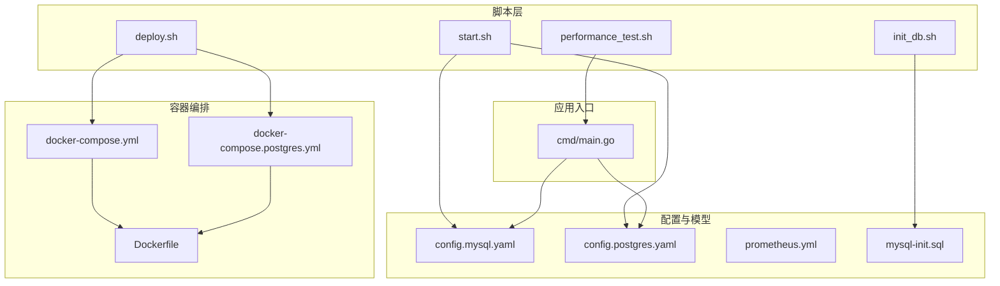
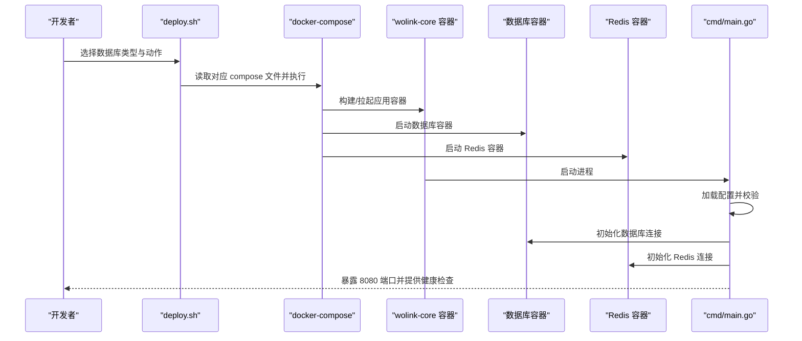
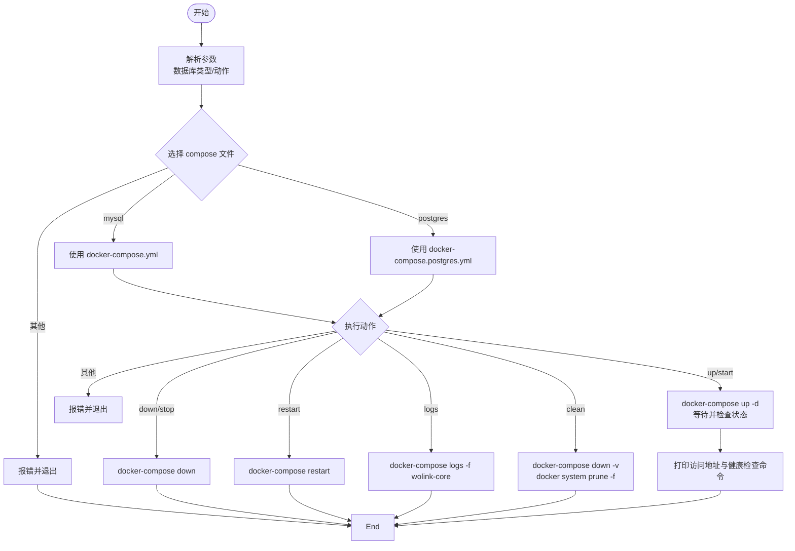
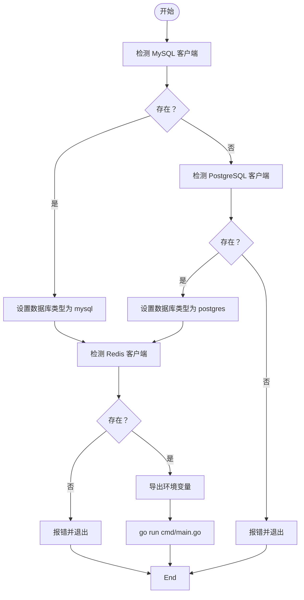
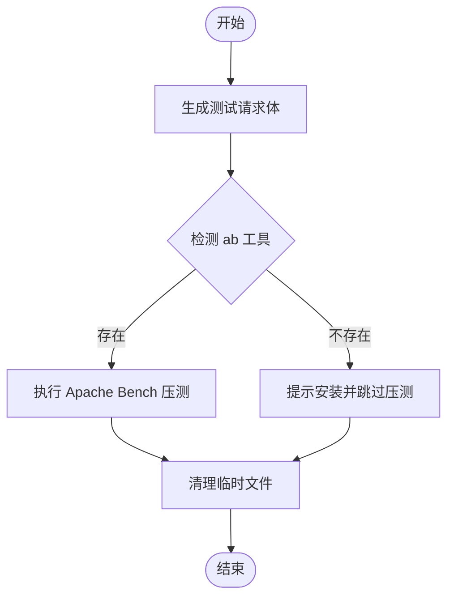
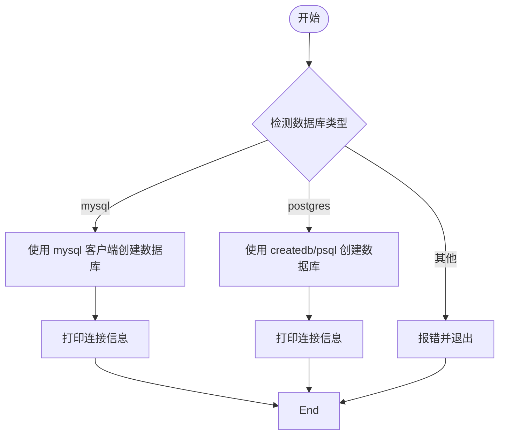
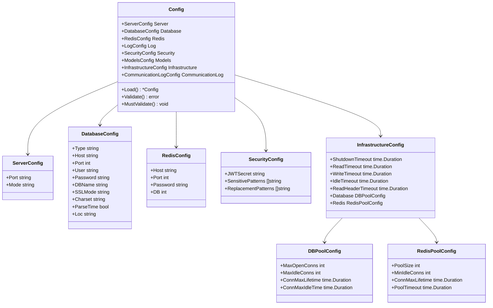
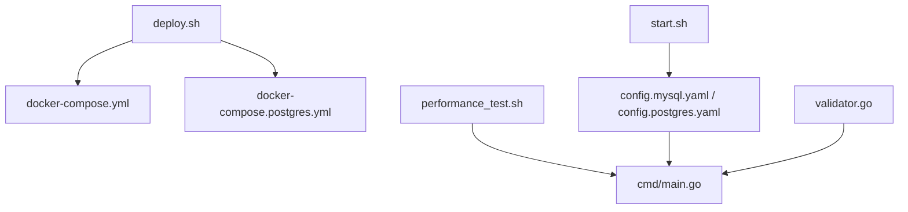

# 自动化部署脚本

<cite>
**本文档引用的文件**
- [deploy.sh](file://scripts/deploy.sh)
- [start.sh](file://scripts/start.sh)
- [performance_test.sh](file://scripts/performance_test.sh)
- [init_db.sh](file://scripts/init_db.sh)
- [Dockerfile](file://Dockerfile)
- [docker-compose.yml](file://docker-compose.yml)
- [docker-compose.postgres.yml](file://docker-compose.postgres.yml)
- [mysql-init.sql](file://scripts/mysql-init.sql)
- [config.mysql.yaml](file://configs/config.mysql.yaml)
- [config.postgres.yaml](file://configs/config.postgres.yaml)
- [prometheus.yml](file://configs/prometheus.yml)
- [main.go](file://cmd/main.go)
- [config.go](file://internal/config/config.go)
- [validator.go](file://internal/config/validator.go)
</cite>

## 目录
1. [简介](#简介)
2. [项目结构](#项目结构)
3. [核心组件](#核心组件)
4. [架构概览](#架构概览)
5. [详细组件分析](#详细组件分析)
6. [依赖关系分析](#依赖关系分析)
7. [性能考量](#性能考量)
8. [故障排除指南](#故障排除指南)
9. [结论](#结论)
10. [附录](#附录)

## 简介
本文件为 Wolink-Core 的自动化部署脚本提供详细使用文档，覆盖以下内容：
- 部署脚本、启动脚本与性能测试脚本的功能与使用场景
- 脚本参数配置与环境准备要求
- 完整自动化部署流程步骤与故障处理方案
- 安全考虑与权限管理
- 脚本扩展与自定义指导（CI/CD 集成、批量部署）
- 调试、日志记录与错误处理最佳实践

Wolink-Core 提供基于 Docker Compose 的一键部署能力，支持 MySQL 与 PostgreSQL 两种数据库后端，并通过独立脚本实现本地开发启动、数据库初始化以及性能测试。

## 项目结构
与自动化部署直接相关的目录与文件如下：
- scripts/：自动化部署与测试脚本
  - deploy.sh：统一部署入口，支持 up/down/restart/logs/clean 等动作
  - start.sh：本地开发启动脚本，自动检测依赖并设置环境变量
  - init_db.sh：数据库初始化脚本，支持 MySQL 与 PostgreSQL
  - performance_test.sh：性能测试脚本，基于 Apache Bench
  - mysql-init.sql：MySQL 初始化 SQL
- configs/：配置文件
  - config.mysql.yaml / config.postgres.yaml：不同数据库类型的配置模板
  - prometheus.yml：Prometheus 监控配置示例
- docker-compose.*.yml：容器编排配置
- Dockerfile：应用镜像构建定义
- cmd/main.go：应用入口，负责加载配置、初始化服务并启动 HTTP 服务器
- internal/config/*：配置加载与校验逻辑

**图表来源**
- [deploy.sh:1-61](file://scripts/deploy.sh#L1-L61)
- [start.sh:1-52](file://scripts/start.sh#L1-L52)
- [init_db.sh:1-46](file://scripts/init_db.sh#L1-L46)
- [performance_test.sh:1-44](file://scripts/performance_test.sh#L1-L44)
- [docker-compose.yml:1-59](file://docker-compose.yml#L1-L59)
- [docker-compose.postgres.yml:1-55](file://docker-compose.postgres.yml#L1-L55)
- [Dockerfile:1-28](file://Dockerfile#L1-L28)
- [config.mysql.yaml:1-37](file://configs/config.mysql.yaml#L1-L37)
- [config.postgres.yaml:1-35](file://configs/config.postgres.yaml#L1-L35)
- [prometheus.yml:1-10](file://configs/prometheus.yml#L1-L10)
- [mysql-init.sql:1-32](file://scripts/mysql-init.sql#L1-L32)
- [main.go:1-89](file://cmd/main.go#L1-L89)

**章节来源**
- [deploy.sh:1-61](file://scripts/deploy.sh#L1-L61)
- [start.sh:1-52](file://scripts/start.sh#L1-L52)
- [init_db.sh:1-46](file://scripts/init_db.sh#L1-L46)
- [performance_test.sh:1-44](file://scripts/performance_test.sh#L1-L44)
- [docker-compose.yml:1-59](file://docker-compose.yml#L1-L59)
- [docker-compose.postgres.yml:1-55](file://docker-compose.postgres.yml#L1-L55)
- [Dockerfile:1-28](file://Dockerfile#L1-L28)
- [config.mysql.yaml:1-37](file://configs/config.mysql.yaml#L1-L37)
- [config.postgres.yaml:1-35](file://configs/config.postgres.yaml#L1-L35)
- [prometheus.yml:1-10](file://configs/prometheus.yml#L1-L10)
- [mysql-init.sql:1-32](file://scripts/mysql-init.sql#L1-L32)
- [main.go:1-89](file://cmd/main.go#L1-L89)

## 核心组件
本节对三个自动化脚本进行功能与使用场景说明，并给出参数与环境准备要点。

- 部署脚本（deploy.sh）
  - 功能：根据数据库类型选择对应的 docker-compose 文件，执行 up/down/restart/logs/clean 等操作
  - 支持参数：数据库类型（mysql/ postgres），动作（up/start、down/stop、restart、logs、clean）
  - 使用场景：生产或测试环境的一键启动、停止、重启、日志查看与资源清理
  - 关键行为：解析参数 → 选择 compose 文件 → 执行对应 docker-compose 命令 → 输出服务状态与访问提示

- 启动脚本（start.sh）
  - 功能：本地开发启动，自动检测数据库与 Redis 客户端，设置环境变量并运行 Go 应用
  - 支持参数：无（内部自动检测数据库类型）
  - 使用场景：开发者在本地快速启动服务进行调试
  - 关键行为：检测依赖 → 设置环境变量（含数据库与 Redis）→ 启动应用

- 性能测试脚本（performance_test.sh）
  - 功能：生成测试请求体并通过 Apache Bench 对 /v1/chat/completions 接口进行压力测试
  - 支持参数：BASE_URL、API_KEY、并发用户数、每用户请求数
  - 使用场景：上线前或回归测试中的吞吐量与延迟评估
  - 关键行为：生成 JSON 请求 → 检测 ab 工具 → 执行压测 → 清理临时文件

- 数据库初始化脚本（init_db.sh）
  - 功能：根据数据库类型创建数据库与必要对象（MySQL 使用 mysql 客户端，PostgreSQL 使用 createdb/psql）
  - 支持参数：数据库类型（mysql/ postgres）
  - 使用场景：首次部署或重置数据库环境
  - 关键行为：选择数据库类型 → 执行初始化命令 → 输出连接信息

**章节来源**
- [deploy.sh:1-61](file://scripts/deploy.sh#L1-L61)
- [start.sh:1-52](file://scripts/start.sh#L1-L52)
- [performance_test.sh:1-44](file://scripts/performance_test.sh#L1-L44)
- [init_db.sh:1-46](file://scripts/init_db.sh#L1-L46)

## 架构概览
下图展示从脚本到容器编排再到应用启动的整体流程，以及配置加载与校验的关键节点。

**图表来源**
- [deploy.sh:1-61](file://scripts/deploy.sh#L1-L61)
- [docker-compose.yml:1-59](file://docker-compose.yml#L1-L59)
- [docker-compose.postgres.yml:1-55](file://docker-compose.postgres.yml#L1-L55)
- [main.go:1-89](file://cmd/main.go#L1-L89)

## 详细组件分析

### 部署脚本（deploy.sh）
- 参数与行为
  - 第一个参数：数据库类型（默认 mysql；支持 postgres/postgresql）
  - 第二个参数：动作（默认 up；支持 down/stop、restart、logs、clean）
  - 动作详解：
    - up/start：后台启动服务，等待并检查容器状态，输出访问地址与健康检查命令
    - down/stop：停止并移除容器
    - restart：重启服务
    - logs：实时查看核心服务日志
    - clean：停止服务并删除命名卷，同时清理未使用的镜像/网络等
- 错误处理：对不支持的数据库类型与动作输出帮助信息并退出非零码
- 输出信息：服务状态、API 地址、健康检查命令

**图表来源**
- [deploy.sh:1-61](file://scripts/deploy.sh#L1-L61)

**章节来源**
- [deploy.sh:1-61](file://scripts/deploy.sh#L1-L61)

### 启动脚本（start.sh）
- 依赖检测
  - MySQL 客户端：若存在则以 MySQL 作为数据库类型
  - PostgreSQL 客户端：若存在且无 MySQL 客户端，则以 PostgreSQL 作为数据库类型
  - Redis 客户端：必须存在
- 环境变量设置（示例范围）
  - 服务器端口、数据库类型、主机、端口、用户、密码、数据库名、字符集、时区等
  - Redis 主机、端口
  - 根据检测结果动态调整数据库类型与端口
- 启动方式：通过 Go 运行入口程序

**图表来源**
- [start.sh:1-52](file://scripts/start.sh#L1-L52)
- [main.go:1-89](file://cmd/main.go#L1-L89)

**章节来源**
- [start.sh:1-52](file://scripts/start.sh#L1-L52)
- [main.go:1-89](file://cmd/main.go#L1-L89)

### 性能测试脚本（performance_test.sh）
- 测试目标：/v1/chat/completions 接口
- 测试工具：Apache Bench（ab）
- 关键参数：并发用户数、每用户请求数、基础 URL、API Key
- 行为流程：生成请求体 → 检测 ab → 执行压测 → 清理临时文件
- 注意事项：若未安装 ab，脚本会提示安装方式并跳过压测

**图表来源**
- [performance_test.sh:1-44](file://scripts/performance_test.sh#L1-L44)

**章节来源**
- [performance_test.sh:1-44](file://scripts/performance_test.sh#L1-L44)

### 数据库初始化脚本（init_db.sh）
- 支持类型：mysql、postgres/postgresql
- 行为：
  - MySQL：使用 mysql 客户端创建数据库并显示连接信息
  - PostgreSQL：使用 createdb/psql 创建数据库并显示连接信息
- 输出：连接信息（主机、端口、数据库名、用户）

**图表来源**
- [init_db.sh:1-46](file://scripts/init_db.sh#L1-L46)

**章节来源**
- [init_db.sh:1-46](file://scripts/init_db.sh#L1-L46)

### 配置加载与校验（config.go 与 validator.go）
- 配置加载
  - 通过 Viper 从 configs 目录与根目录读取 YAML 配置
  - 支持环境变量前缀 AI_GATEWAY_，便于容器化部署时注入
  - 提供默认值集合，涵盖服务器、数据库、Redis、日志、安全、模型路径、基础设施与通信日志等
- 配置校验（安全相关）
  - JWT 密钥长度至少 32 字符，且不得使用常见默认模式
  - 生产模式（release）下，数据库与 Redis 密码必须配置
- 应用入口
  - main.go 中加载配置、初始化日志、数据库与 Redis，创建 HTTP 服务器并优雅关闭

**图表来源**
- [config.go:1-185](file://internal/config/config.go#L1-L185)
- [validator.go:1-88](file://internal/config/validator.go#L1-L88)

**章节来源**
- [config.go:1-185](file://internal/config/config.go#L1-L185)
- [validator.go:1-88](file://internal/config/validator.go#L1-L88)
- [main.go:1-89](file://cmd/main.go#L1-L89)

## 依赖关系分析
- 脚本与容器编排
  - deploy.sh 依据数据库类型选择 docker-compose.yml 或 docker-compose.postgres.yml
  - docker-compose.*.yml 定义 wolink-core、数据库与 Redis 服务及其依赖关系
- 脚本与应用
  - start.sh 通过环境变量驱动 main.go 的配置加载
  - performance_test.sh 依赖应用暴露的 /v1/chat/completions 接口
- 配置与安全
  - config.go 提供默认值与环境变量映射
  - validator.go 在生产模式下强制要求数据库/Redis 密码与强 JWT 密钥

**图表来源**
- [deploy.sh:1-61](file://scripts/deploy.sh#L1-L61)
- [docker-compose.yml:1-59](file://docker-compose.yml#L1-L59)
- [docker-compose.postgres.yml:1-55](file://docker-compose.postgres.yml#L1-L55)
- [start.sh:1-52](file://scripts/start.sh#L1-L52)
- [config.mysql.yaml:1-37](file://configs/config.mysql.yaml#L1-L37)
- [config.postgres.yaml:1-35](file://configs/config.postgres.yaml#L1-L35)
- [performance_test.sh:1-44](file://scripts/performance_test.sh#L1-L44)
- [main.go:1-89](file://cmd/main.go#L1-L89)
- [validator.go:1-88](file://internal/config/validator.go#L1-L88)

**章节来源**
- [deploy.sh:1-61](file://scripts/deploy.sh#L1-L61)
- [docker-compose.yml:1-59](file://docker-compose.yml#L1-L59)
- [docker-compose.postgres.yml:1-55](file://docker-compose.postgres.yml#L1-L55)
- [start.sh:1-52](file://scripts/start.sh#L1-L52)
- [config.mysql.yaml:1-37](file://configs/config.mysql.yaml#L1-L37)
- [config.postgres.yaml:1-35](file://configs/config.postgres.yaml#L1-L35)
- [performance_test.sh:1-44](file://scripts/performance_test.sh#L1-L44)
- [main.go:1-89](file://cmd/main.go#L1-L89)
- [validator.go:1-88](file://internal/config/validator.go#L1-L88)

## 性能考量
- 并发与吞吐
  - performance_test.sh 支持通过参数调节并发用户数与每用户请求数，从而控制总请求数
  - 建议在测试前确保数据库与 Redis 容器已就绪，避免测试结果受冷启动影响
- 连接池与超时
  - 配置中提供数据库与 Redis 连接池参数（最大连接数、空闲连接数、生命周期等）
  - HTTP 服务器超时（读取、写入、空闲、头部读取）与优雅关闭超时可按需调整
- 监控
  - prometheus.yml 提供基础指标抓取配置，建议在生产环境中启用并结合可视化面板监控

**章节来源**
- [performance_test.sh:1-44](file://scripts/performance_test.sh#L1-L44)
- [config.go:168-184](file://internal/config/config.go#L168-L184)
- [prometheus.yml:1-10](file://configs/prometheus.yml#L1-L10)

## 故障排除指南
- 部署脚本（deploy.sh）
  - 不支持的数据库类型：确认传入参数是否为 mysql 或 postgres
  - 不支持的动作：确认传入参数是否为 up/down/restart/logs/clean
  - 容器启动失败：使用 logs 动作查看核心服务日志，检查数据库与 Redis 是否健康
  - 清理后数据丢失：clean 会删除命名卷，注意备份重要数据
- 启动脚本（start.sh）
  - 缺少数据库或 Redis 客户端：按提示安装相应客户端并重试
  - 环境变量冲突：确保未手动覆盖关键环境变量，或在容器化部署时通过 compose 注入
- 性能测试脚本（performance_test.sh）
  - ab 未安装：按脚本提示安装 Apache Bench，或改用其他压测工具
  - 接口返回异常：确认应用已启动且 /v1/chat/completions 可用，检查 API Key 与请求体
- 配置与安全（config.go 与 validator.go）
  - JWT 密钥校验失败：更换为至少 32 字符且非默认的密钥
  - 生产模式缺少密码：在 release 模式下为数据库与 Redis 配置密码
- 数据库初始化（init_db.sh）
  - 权限不足：确保具有创建数据库的权限，或使用具备足够权限的账户
  - 数据库已存在：脚本会提示可能已存在，继续后续流程即可

**章节来源**
- [deploy.sh:1-61](file://scripts/deploy.sh#L1-L61)
- [start.sh:1-52](file://scripts/start.sh#L1-L52)
- [performance_test.sh:1-44](file://scripts/performance_test.sh#L1-L44)
- [config.go:1-185](file://internal/config/config.go#L1-L185)
- [validator.go:1-88](file://internal/config/validator.go#L1-L88)
- [init_db.sh:1-46](file://scripts/init_db.sh#L1-L46)

## 结论
Wolink-Core 的自动化部署脚本提供了从本地开发到生产部署的完整路径：通过 deploy.sh 与 docker-compose 实现一键部署，通过 init_db.sh 快速初始化数据库，通过 start.sh 本地验证，通过 performance_test.sh 进行性能评估。配合 config.go 与 validator.go 的配置与安全校验，可在保证安全性的同时实现稳定可靠的运行。

## 附录

### 环境准备清单
- 本地开发
  - 安装 Go 运行时与 Git
  - 安装 MySQL/PostgreSQL 客户端与 Redis 客户端
  - 确保端口未被占用（8080、数据库端口、Redis 端口）
- 容器化部署
  - 安装 Docker 与 Docker Compose
  - 准备 MySQL/PostgreSQL 与 Redis 数据卷（由 compose 自动管理）
- 监控与日志
  - 准备 Prometheus 采集器（如已启用）
  - 确保应用日志可访问（compose 日志或宿主机挂载）

### 安全考虑与权限管理
- 环境变量注入
  - 通过 AI_GATEWAY_ 前缀的环境变量注入配置，避免硬编码
- 生产模式安全
  - release 模式下必须配置数据库与 Redis 密码
  - JWT 密钥长度至少 32 字符，避免使用常见默认值
- 最小权限原则
  - 数据库用户仅授予必要权限
  - Redis 用户仅授予所需访问权限

### 脚本扩展与自定义
- CI/CD 集成
  - 将 deploy.sh 与 init_db.sh 组合为流水线步骤，先初始化数据库再启动服务
  - 在流水线中注入环境变量（如数据库密码、Redis 密码、JWT 密钥）
- 批量部署
  - 通过多实例 compose 文件或外部编排工具（如 Kubernetes）扩展
  - 使用不同的环境变量前缀区分不同环境（如 AI_GATEWAY_DEV、AI_GATEWAY_PROD）
- 自定义配置
  - 在 configs/ 下新增 YAML 配置文件，或通过环境变量覆盖默认值
  - 根据业务需要调整连接池、超时与日志级别

### 调试、日志记录与错误处理最佳实践
- 调试
  - 使用 logs 动作查看实时日志
  - 在 start.sh 中临时降低日志级别以获取更详细信息
- 日志记录
  - 通过配置项设置日志级别，生产环境建议使用 info 或更高
  - 启用通信日志（如需要）以追踪 LLM 交互
- 错误处理
  - 部分脚本在依赖缺失或参数错误时会直接退出，建议在调用前进行前置检查
  - 在 CI/CD 中捕获脚本返回码并进行相应处理