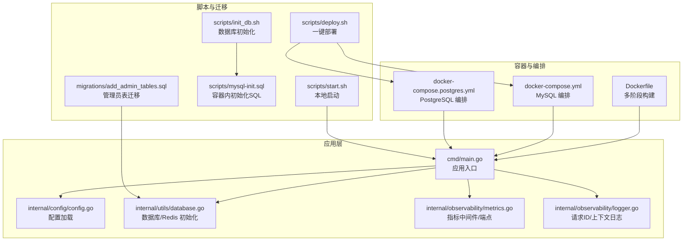
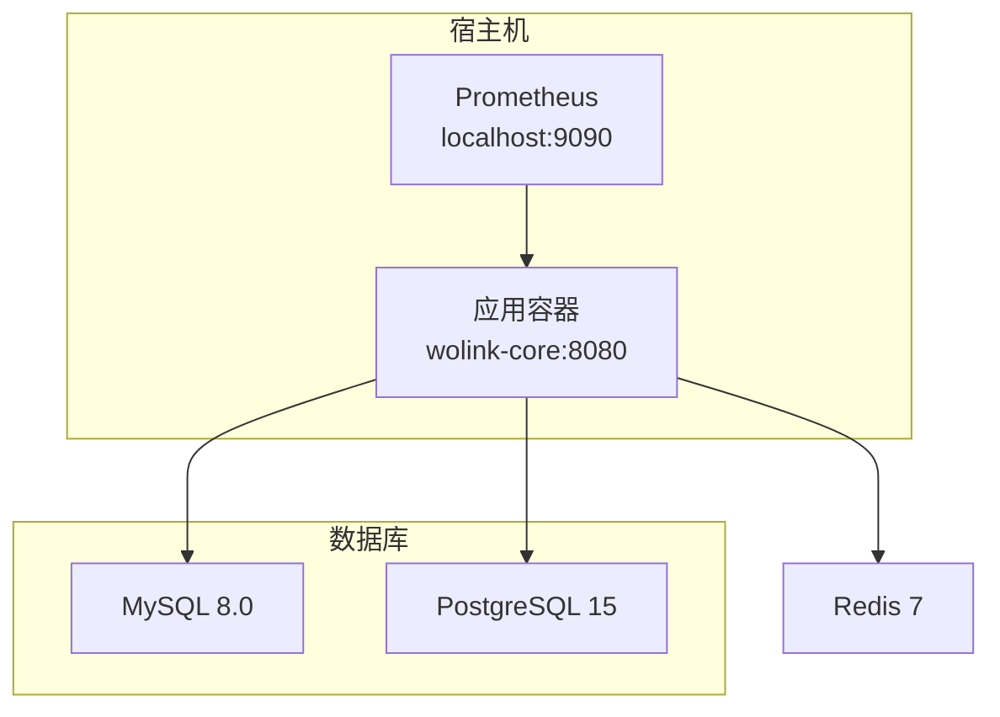
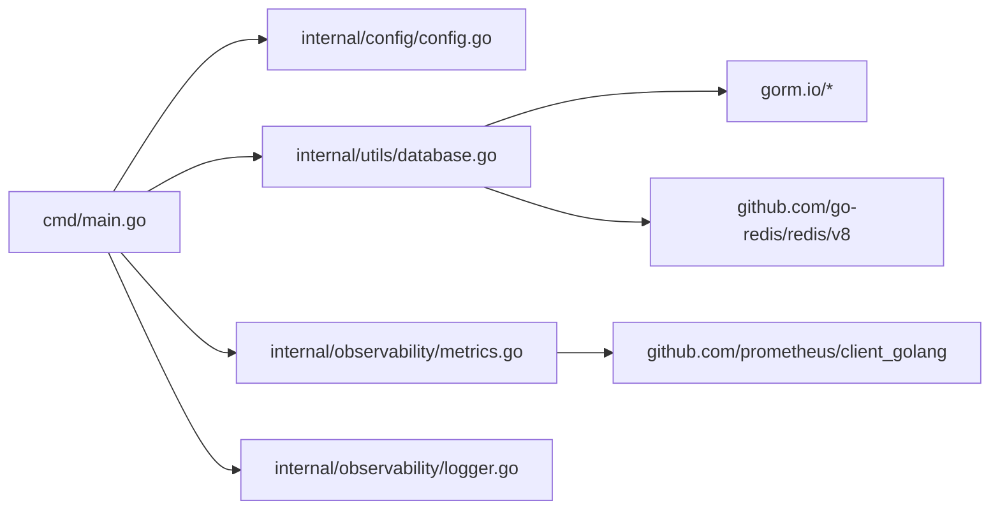

# 部署与运维

<cite>
**本文引用的文件**
- [Dockerfile](file://Dockerfile)
- [docker-compose.yml](file://docker-compose.yml)
- [docker-compose.postgres.yml](file://docker-compose.postgres.yml)
- [cmd/main.go](file://cmd/main.go)
- [internal/config/config.go](file://internal/config/config.go)
- [internal/utils/database.go](file://internal/utils/database.go)
- [internal/observability/metrics.go](file://internal/observability/metrics.go)
- [internal/observability/logger.go](file://internal/observability/logger.go)
- [scripts/deploy.sh](file://scripts/deploy.sh)
- [scripts/start.sh](file://scripts/start.sh)
- [scripts/init_db.sh](file://scripts/init_db.sh)
- [scripts/mysql-init.sql](file://scripts/mysql-init.sql)
- [migrations/add_admin_tables.sql](file://migrations/add_admin_tables.sql)
- [configs/config.mysql.yaml](file://configs/config.mysql.yaml)
- [configs/config.postgres.yaml](file://configs/config.postgres.yaml)
- [configs/prometheus.yml](file://configs/prometheus.yml)
- [go.mod](file://go.mod)
</cite>

## 目录
1. [简介](#简介)
2. [项目结构](#项目结构)
3. [核心组件](#核心组件)
4. [架构总览](#架构总览)
5. [详细组件分析](#详细组件分析)
6. [依赖分析](#依赖分析)
7. [性能考虑](#性能考虑)
8. [故障排查指南](#故障排查指南)
9. [结论](#结论)
10. [附录](#附录)

## 简介
本文件面向运维与开发团队，提供 Wolink-Core 的完整部署与运维指南。内容覆盖 Docker 容器化与 Compose 多服务编排、环境配置管理、数据库初始化与迁移、监控与日志、故障排查以及自动化部署脚本的使用与扩展建议。

## 项目结构
Wolink-Core 采用模块化组织方式，核心入口位于命令行程序，配置通过 Viper 读取 YAML 并支持环境变量覆盖；数据库与 Redis 通过工具函数初始化；Prometheus 指标通过中间件暴露；Compose 提供 MySQL 与 PostgreSQL 双栈编排。

图示来源
- [Dockerfile:1-28](file://Dockerfile#L1-L28)
- [docker-compose.yml:1-59](file://docker-compose.yml#L1-L59)
- [docker-compose.postgres.yml:1-55](file://docker-compose.postgres.yml#L1-L55)
- [cmd/main.go:19-89](file://cmd/main.go#L19-L89)
- [internal/config/config.go:96-124](file://internal/config/config.go#L96-L124)
- [internal/utils/database.go:73-140](file://internal/utils/database.go#L73-L140)
- [internal/observability/metrics.go:53-93](file://internal/observability/metrics.go#L53-L93)
- [internal/observability/logger.go:16-43](file://internal/observability/logger.go#L16-L43)
- [scripts/deploy.sh:1-61](file://scripts/deploy.sh#L1-L61)
- [scripts/start.sh:1-52](file://scripts/start.sh#L1-L52)
- [scripts/init_db.sh:1-46](file://scripts/init_db.sh#L1-L46)
- [scripts/mysql-init.sql:1-32](file://scripts/mysql-init.sql#L1-L32)
- [migrations/add_admin_tables.sql:1-38](file://migrations/add_admin_tables.sql#L1-L38)

章节来源
- [Dockerfile:1-28](file://Dockerfile#L1-L28)
- [docker-compose.yml:1-59](file://docker-compose.yml#L1-L59)
- [docker-compose.postgres.yml:1-55](file://docker-compose.postgres.yml#L1-L55)
- [cmd/main.go:19-89](file://cmd/main.go#L19-L89)
- [internal/config/config.go:96-124](file://internal/config/config.go#L96-L124)
- [internal/utils/database.go:73-140](file://internal/utils/database.go#L73-L140)
- [internal/observability/metrics.go:53-93](file://internal/observability/metrics.go#L53-L93)
- [internal/observability/logger.go:16-43](file://internal/observability/logger.go#L16-L43)
- [scripts/deploy.sh:1-61](file://scripts/deploy.sh#L1-L61)
- [scripts/start.sh:1-52](file://scripts/start.sh#L1-L52)
- [scripts/init_db.sh:1-46](file://scripts/init_db.sh#L1-L46)
- [scripts/mysql-init.sql:1-32](file://scripts/mysql-init.sql#L1-L32)
- [migrations/add_admin_tables.sql:1-38](file://migrations/add_admin_tables.sql#L1-L38)

## 核心组件
- 应用入口与生命周期：负责加载配置、初始化数据库与 Redis、创建路由、启动 HTTP 服务器，并在收到信号时优雅关闭。
- 配置系统：支持 YAML 文件与环境变量（带前缀）混合配置，提供默认值与强类型结构体映射。
- 数据库与缓存：支持 MySQL、PostgreSQL 与 SQLite，自动迁移模型；连接池参数可配置。
- 指标与日志：内置 Prometheus 中间件与 /metrics 端点；日志支持请求 ID 注入与上下文字段。
- 编排与镜像：多阶段构建 Docker 镜像；提供 MySQL 与 PostgreSQL 两套 Compose 编排。

章节来源
- [cmd/main.go:19-89](file://cmd/main.go#L19-L89)
- [internal/config/config.go:96-184](file://internal/config/config.go#L96-L184)
- [internal/utils/database.go:73-140](file://internal/utils/database.go#L73-L140)
- [internal/observability/metrics.go:53-93](file://internal/observability/metrics.go#L53-L93)
- [internal/observability/logger.go:16-43](file://internal/observability/logger.go#L16-L43)
- [Dockerfile:1-28](file://Dockerfile#L1-L28)
- [docker-compose.yml:1-59](file://docker-compose.yml#L1-L59)
- [docker-compose.postgres.yml:1-55](file://docker-compose.postgres.yml#L1-L55)

## 架构总览
下图展示容器化部署下的典型拓扑：应用容器依赖 MySQL/PostgreSQL 与 Redis；应用暴露 HTTP 与 /metrics；Prometheus 从宿主机抓取指标。

图示来源
- [docker-compose.yml:3-59](file://docker-compose.yml#L3-L59)
- [docker-compose.postgres.yml:3-55](file://docker-compose.postgres.yml#L3-L55)
- [configs/prometheus.yml:1-10](file://configs/prometheus.yml#L1-L10)

## 详细组件分析

### Docker 容器化与镜像构建
- 多阶段构建：第一阶段使用官方 Go 镜像下载依赖并编译静态二进制；第二阶段基于 Alpine，复制二进制与配置，暴露 8080 端口，CMD 启动应用。
- 运行时：容器内以非 CGO 方式运行，减少外部依赖；配置目录随镜像一起打包，便于环境变量覆盖。

章节来源
- [Dockerfile:1-28](file://Dockerfile#L1-L28)

### Docker Compose 多服务编排
- MySQL 编排：提供健康检查、持久化卷、初始化 SQL；应用服务依赖 MySQL 健康后再启动。
- PostgreSQL 编排：与 MySQL 编排类似，但使用 PostgreSQL 镜像与不同的环境变量键名。
- 通用依赖：应用均依赖 Redis，且 Redis 不要求健康检查条件。

章节来源
- [docker-compose.yml:1-59](file://docker-compose.yml#L1-L59)
- [docker-compose.postgres.yml:1-55](file://docker-compose.postgres.yml#L1-L55)

### 环境配置管理
- 配置来源优先级：环境变量 > YAML 文件 > 默认值。环境变量统一使用前缀，便于在 Compose 中注入。
- 关键配置项：
  - 服务器：端口、模式（debug/release）
  - 数据库：类型、主机、端口、用户、密码、库名、字符集/SSL 模式等
  - Redis：主机、端口、密码、DB
  - 日志：级别
  - 安全：JWT 密钥与敏感信息替换规则
  - 模型配置路径
  - 基础设施：超时、连接池参数
- 示例配置文件：MySQL 与 PostgreSQL 两套默认配置，便于切换。

章节来源
- [internal/config/config.go:96-184](file://internal/config/config.go#L96-L184)
- [configs/config.mysql.yaml:1-37](file://configs/config.mysql.yaml#L1-L37)
- [configs/config.postgres.yaml:1-35](file://configs/config.postgres.yaml#L1-L35)

### 数据库初始化、迁移与备份恢复
- 初始化脚本：提供独立脚本创建数据库（MySQL/PostgreSQL），并输出连接信息。
- 容器内初始化：MySQL 编排通过挂载 SQL 文件实现初始化。
- 自动迁移：应用启动时对核心模型执行自动迁移。
- 管理员表迁移：提供管理员用户与会话表的迁移脚本，含默认超级管理员示例。
- 备份与恢复建议：
  - MySQL：使用逻辑备份工具导出/导入，结合 Compose 卷进行数据持久化。
  - PostgreSQL：使用 pg_dump/pg_restore。
  - Redis：如需持久化，可在生产中启用 RDB/AOF或使用外部持久化方案。

章节来源
- [scripts/init_db.sh:1-46](file://scripts/init_db.sh#L1-L46)
- [scripts/mysql-init.sql:1-32](file://scripts/mysql-init.sql#L1-L32)
- [internal/utils/database.go:109-122](file://internal/utils/database.go#L109-L122)
- [migrations/add_admin_tables.sql:1-38](file://migrations/add_admin_tables.sql#L1-L38)

### 性能监控与日志
- 指标采集：内置 Prometheus 中间件与 /metrics 端点，记录请求总量、延迟直方图与并发请求数。
- 日志：支持请求 ID 注入，便于跨服务追踪；日志级别可通过配置控制。
- 监控配置：提供 Prometheus 抓取配置示例，目标为应用的 /metrics。

章节来源
- [internal/observability/metrics.go:53-93](file://internal/observability/metrics.go#L53-L93)
- [internal/observability/logger.go:16-43](file://internal/observability/logger.go#L16-L43)
- [configs/prometheus.yml:1-10](file://configs/prometheus.yml#L1-L10)

### 自动化部署脚本
- 一键部署脚本：支持选择数据库类型（MySQL/PostgreSQL）、执行启动/停止/重启/查看日志/清理等操作。
- 本地启动脚本：检测数据库客户端与 Redis，按检测结果设置环境变量并直接运行应用。
- 使用建议：在 CI/CD 中调用一键部署脚本；生产环境建议配合 systemd 或容器编排平台。

章节来源
- [scripts/deploy.sh:1-61](file://scripts/deploy.sh#L1-L61)
- [scripts/start.sh:1-52](file://scripts/start.sh#L1-L52)

## 依赖分析
- 应用入口依赖配置模块、服务与工具模块；工具模块进一步依赖数据库驱动与 Redis 客户端。
- Compose 服务之间通过网络互通，应用容器通过环境变量访问数据库与 Redis。
- 指标与日志模块为横切关注点，被路由与中间件使用。

图示来源
- [cmd/main.go:19-89](file://cmd/main.go#L19-L89)
- [internal/config/config.go:96-184](file://internal/config/config.go#L96-L184)
- [internal/utils/database.go:73-140](file://internal/utils/database.go#L73-L140)
- [internal/observability/metrics.go:53-93](file://internal/observability/metrics.go#L53-L93)
- [go.mod:1-84](file://go.mod#L1-L84)

章节来源
- [go.mod:1-84](file://go.mod#L1-L84)
- [cmd/main.go:19-89](file://cmd/main.go#L19-L89)
- [internal/utils/database.go:73-140](file://internal/utils/database.go#L73-L140)

## 性能考虑
- 连接池：数据库与 Redis 的连接池参数可配置，避免默认值在高并发场景下的瓶颈。
- 超时设置：读/写/空闲/头部读取超时可调，降低慢请求对系统的影响。
- 指标观测：通过 /metrics 与 Prometheus 持续观测延迟分布与并发量，定位热点接口与资源瓶颈。
- 静态二进制：多阶段构建产物为静态链接，减少运行时依赖，提升启动与部署稳定性。

章节来源
- [internal/config/config.go:21-47](file://internal/config/config.go#L21-L47)
- [internal/utils/database.go:19-42](file://internal/utils/database.go#L19-L42)
- [internal/observability/metrics.go:23-33](file://internal/observability/metrics.go#L23-L33)

## 故障排查指南
- 启动失败
  - 检查配置是否正确加载（YAML 与环境变量），确认端口未被占用。
  - 查看应用日志与容器日志，定位初始化错误。
- 数据库连接问题
  - 确认数据库服务健康（Compose 健康检查），核对凭据与网络连通性。
  - 如使用容器内初始化 SQL，请确认挂载路径与权限。
- Redis 连接问题
  - 确认 Redis 服务可用，检查密码与 DB 索引。
- 指标不可见
  - 确认 /metrics 路由已注册，Prometheus 抓取间隔与目标地址正确。
- 优雅关闭
  - 应用监听系统信号，确保在容器终止时有足够宽限时间完成清理。

章节来源
- [cmd/main.go:19-89](file://cmd/main.go#L19-L89)
- [docker-compose.yml:39-42](file://docker-compose.yml#L39-L42)
- [docker-compose.postgres.yml:35-38](file://docker-compose.postgres.yml#L35-L38)
- [internal/observability/metrics.go:88-93](file://internal/observability/metrics.go#L88-L93)

## 结论
Wolink-Core 提供了完善的容器化与编排能力，结合灵活的配置体系、自动化的初始化与迁移机制、可观测性中间件与脚本化运维工具，能够满足从开发到生产的多种部署需求。建议在生产环境中进一步完善密钥管理、网络隔离、备份策略与告警联动。

## 附录

### 部署步骤（MySQL）
- 使用一键部署脚本选择数据库类型并启动服务。
- 若需本地启动，先安装数据库与 Redis 客户端，再运行本地启动脚本。
- 初次启动后，应用会自动迁移核心模型；如需管理员功能，可执行管理员表迁移脚本。

章节来源
- [scripts/deploy.sh:12-38](file://scripts/deploy.sh#L12-L38)
- [scripts/start.sh:10-26](file://scripts/start.sh#L10-L26)
- [internal/utils/database.go:109-122](file://internal/utils/database.go#L109-L122)
- [migrations/add_admin_tables.sql:29-32](file://migrations/add_admin_tables.sql#L29-L32)

### 部署步骤（PostgreSQL）
- 使用一键部署脚本选择 PostgreSQL，其余流程与 MySQL 类似。
- 注意环境变量键名差异（例如 SSL 模式）。

章节来源
- [scripts/deploy.sh:16-18](file://scripts/deploy.sh#L16-L18)
- [docker-compose.postgres.yml:8-17](file://docker-compose.postgres.yml#L8-L17)
- [configs/config.postgres.yaml:5-12](file://configs/config.postgres.yaml#L5-L12)

### 监控与日志配置
- 在 Prometheus 中添加抓取任务，目标为应用的 /metrics。
- 日志级别与请求 ID 可通过配置项调整，便于问题定位。

章节来源
- [configs/prometheus.yml:1-10](file://configs/prometheus.yml#L1-L10)
- [internal/config/config.go:74-76](file://internal/config/config.go#L74-L76)
- [internal/observability/logger.go:16-43](file://internal/observability/logger.go#L16-L43)