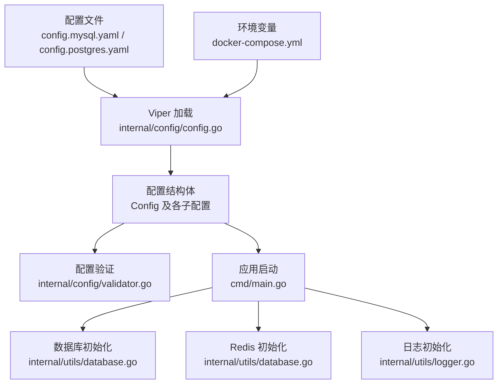
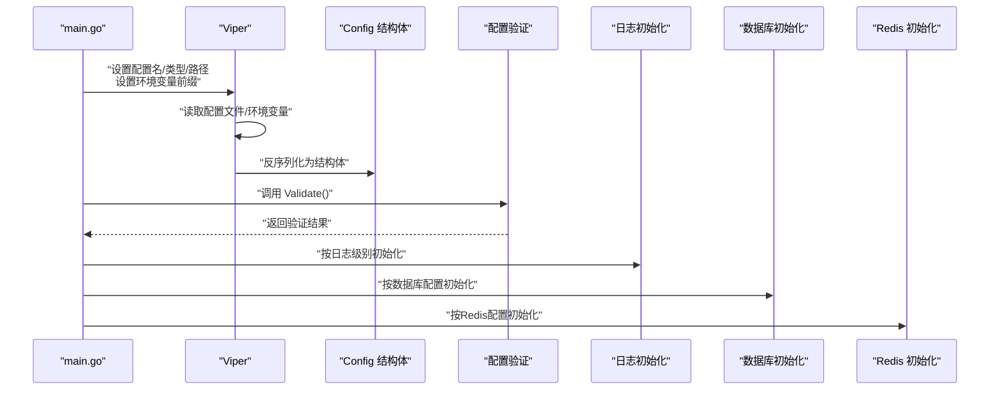
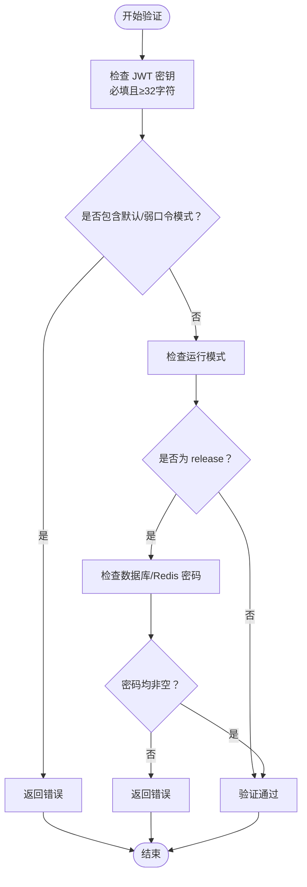
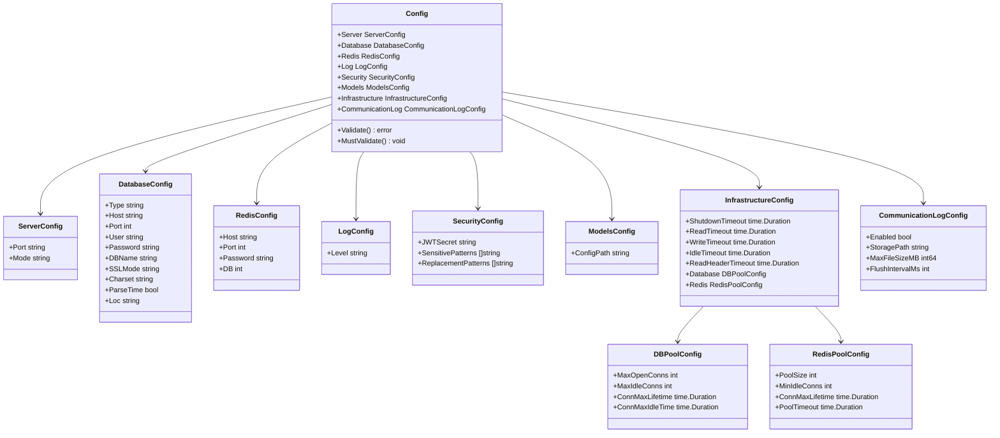

# 配置管理系统

<cite>
**本文档引用的文件**
- [internal/config/config.go](file://internal/config/config.go)
- [internal/config/validator.go](file://internal/config/validator.go)
- [internal/config/validator_test.go](file://internal/config/validator_test.go)
- [internal/config/infrastructure_test.go](file://internal/config/infrastructure_test.go)
- [cmd/main.go](file://cmd/main.go)
- [internal/utils/database.go](file://internal/utils/database.go)
- [internal/utils/logger.go](file://internal/utils/logger.go)
- [configs/config.mysql.yaml](file://configs/config.mysql.yaml)
- [configs/config.postgres.yaml](file://configs/config.postgres.yaml)
- [configs/prometheus.yml](file://configs/prometheus.yml)
- [docker-compose.yml](file://docker-compose.yml)
- [configs/models/qwen3-chat.yaml](file://configs/models/qwen3-chat.yaml)
- [configs/models/qwen-tts.yaml](file://configs/models/qwen-tts.yaml)
- [configs/models/qwen3-asr.yaml](file://configs/models/qwen3-asr.yaml)
- [configs/templates/gpt-4.yaml](file://configs/templates/gpt-4.yaml)
</cite>

## 目录
1. [简介](#简介)
2. [项目结构](#项目结构)
3. [核心组件](#核心组件)
4. [架构总览](#架构总览)
5. [详细组件分析](#详细组件分析)
6. [依赖关系分析](#依赖关系分析)
7. [性能考虑](#性能考虑)
8. [故障排除指南](#故障排除指南)
9. [结论](#结论)
10. [附录](#附录)

## 简介
本文件系统化阐述 Wolink-Core 的配置管理系统，涵盖配置文件结构与层次、环境变量支持、默认值配置、配置验证机制、部署环境示例（开发/测试/生产）、配置热更新机制与影响范围、配置安全最佳实践以及常见配置错误排查方法。该系统基于 Viper 实现配置加载与环境变量映射，并通过严格的配置验证确保运行时安全与稳定性。

## 项目结构
配置管理相关的核心文件分布如下：
- 配置定义与加载：internal/config/config.go
- 配置验证：internal/config/validator.go
- 配置示例：configs/config.mysql.yaml、configs/config.postgres.yaml
- 运行时应用：cmd/main.go
- 数据库与Redis初始化：internal/utils/database.go
- 日志级别解析：internal/utils/logger.go
- 容器编排与环境变量注入：docker-compose.yml
- 模型与模板配置：configs/models/*.yaml、configs/templates/*.yaml
- 监控指标：configs/prometheus.yml

图表来源
- [internal/config/config.go:96-124](file://internal/config/config.go#L96-L124)
- [docker-compose.yml:8-25](file://docker-compose.yml#L8-L25)
- [cmd/main.go:19-89](file://cmd/main.go#L19-L89)
- [internal/utils/database.go:77-139](file://internal/utils/database.go#L77-L139)
- [internal/utils/logger.go:9-30](file://internal/utils/logger.go#L9-L30)

章节来源
- [internal/config/config.go:10-185](file://internal/config/config.go#L10-L185)
- [configs/config.mysql.yaml:1-37](file://configs/config.mysql.yaml#L1-L37)
- [configs/config.postgres.yaml:1-35](file://configs/config.postgres.yaml#L1-L35)
- [cmd/main.go:19-89](file://cmd/main.go#L19-L89)
- [docker-compose.yml:1-59](file://docker-compose.yml#L1-L59)

## 核心组件
配置系统由以下核心组件构成：
- Config 结构体：聚合所有配置项，包括服务器、数据库、Redis、日志、安全、模型、基础设施、通信日志等。
- 子配置类型：ServerConfig、DatabaseConfig、RedisConfig、LogConfig、SecurityConfig、ModelsConfig、InfrastructureConfig、CommunicationLogConfig、DBPoolConfig、RedisPoolConfig。
- 加载与默认值：通过 Viper 设置配置文件路径、环境变量前缀、自动环境变量映射以及默认值。
- 验证机制：对 JWT 密钥强度、生产模式必需凭据进行校验；提供 MustValidate 快速失败接口。
- 应用集成：在 main 中加载配置后，传递给日志、数据库、Redis、路由与HTTP服务器初始化。

章节来源
- [internal/config/config.go:10-185](file://internal/config/config.go#L10-L185)
- [internal/config/validator.go:18-87](file://internal/config/validator.go#L18-L87)
- [cmd/main.go:19-89](file://cmd/main.go#L19-L89)

## 架构总览
配置系统采用“配置文件 + 环境变量 + 默认值”的分层策略，通过 Viper 统一解析与反序列化到结构体，随后由验证模块进行安全与一致性检查，最终驱动应用启动与资源初始化。

图表来源
- [internal/config/config.go:96-124](file://internal/config/config.go#L96-L124)
- [internal/config/validator.go:18-87](file://internal/config/validator.go#L18-L87)
- [cmd/main.go:19-89](file://cmd/main.go#L19-L89)

## 详细组件分析

### 配置文件结构与层次
- 顶层配置键
  - server：端口与运行模式
  - database：数据库类型、主机、端口、用户、密码、库名、SSL/字符集等
  - redis：主机、端口、密码、DB索引
  - log：日志级别
  - security：JWT密钥与敏感信息脱敏规则
  - models：模型配置路径
  - infrastructure：优雅停机超时、HTTP超时、连接池配置
  - communication_log：通信日志开关、存储路径、文件大小限制、刷新间隔
- 子配置层次
  - infrastructure.database_pool / infrastructure.redis_pool：分别控制数据库与Redis连接池参数
- 示例配置
  - MySQL 示例：configs/config.mysql.yaml
  - PostgreSQL 示例：configs/config.postgres.yaml

章节来源
- [internal/config/config.go:10-94](file://internal/config/config.go#L10-L94)
- [configs/config.mysql.yaml:1-37](file://configs/config.mysql.yaml#L1-L37)
- [configs/config.postgres.yaml:1-35](file://configs/config.postgres.yaml#L1-L35)

### 环境变量支持与映射
- Viper 环境变量前缀：AI_GATEWAY_
- 自动环境变量映射：Viper.AutomaticEnv() 将配置键转换为大写并以前缀+下划线形式映射
- 示例映射（来自 docker-compose.yml）：
  - AI_GATEWAY_DATABASE_TYPE → database.type
  - AI_GATEWAY_DATABASE_HOST → database.host
  - AI_GATEWAY_DATABASE_PORT → database.port
  - AI_GATEWAY_DATABASE_USER → database.user
  - AI_GATEWAY_DATABASE_PASSWORD → database.password
  - AI_GATEWAY_DATABASE_DBNAME → database.dbname
  - AI_GATEWAY_DATABASE_CHARSET → database.charset
  - AI_GATEWAY_DATABASE_PARSETIME → database.parsetime
  - AI_GATEWAY_DATABASE_LOC → database.loc
  - AI_GATEWAY_REDIS_HOST → redis.host
  - AI_GATEWAY_REDIS_PORT → redis.port
- 优先级：环境变量 > 配置文件 > 默认值

章节来源
- [internal/config/config.go:96-104](file://internal/config/config.go#L96-L104)
- [docker-compose.yml:8-25](file://docker-compose.yml#L8-L25)

### 默认值配置
- 服务器：端口 8080，模式 debug
- 数据库：type=mysql，host=localhost，port=3306，user=root，dbname=ai_gateway，sslmode=disable，charset=utf8mb4，parsetime=true，loc=Local
- Redis：host=localhost，port=6379，password=空，db=0
- 日志：level=info
- 安全：jwt_secret=默认值，敏感模式与替换模式预设
- 模型：config_path=./configs/models
- 通信日志：enabled=false，storage_path=./logs/communications，max_file_size_mb=100，flush_interval_ms=1000
- 基础设施：优雅停机与HTTP超时默认值
- 连接池：数据库最大并发、空闲连接、连接最大生命周期；Redis池大小、最小空闲连接、连接最大生命周期

章节来源
- [internal/config/config.go:126-184](file://internal/config/config.go#L126-L184)

### 配置验证机制
- JWT 密钥验证（SEC-02）
  - 必填且长度≥32字符
  - 不得包含已知弱口令模式（如 your-secret-key、secret、jwt-secret、changeme 等）
- 生产模式验证（SEC-01）
  - 当 server.mode=release 时，要求 database.password 与 redis.password 均非空
- 快速失败接口
  - MustValidate 在验证失败时打印错误并退出进程

图表来源
- [internal/config/validator.go:18-87](file://internal/config/validator.go#L18-L87)

章节来源
- [internal/config/validator.go:18-87](file://internal/config/validator.go#L18-L87)
- [internal/config/validator_test.go:9-227](file://internal/config/validator_test.go#L9-L227)

### 基础设施与连接池配置
- 基础设施超时
  - shutdown_timeout、read_timeout、write_timeout、idle_timeout、read_header_timeout
- 数据库连接池
  - max_open_conns、max_idle_conns、conn_max_lifetime、conn_max_idle_time
- Redis 连接池
  - pool_size、min_idle_conns、conn_max_lifetime、pool_timeout
- 连接池应用逻辑
  - 仅当配置值>0时才覆盖默认值，否则使用Go标准库默认行为

章节来源
- [internal/config/config.go:21-47](file://internal/config/config.go#L21-L47)
- [internal/utils/database.go:19-42](file://internal/utils/database.go#L19-L42)
- [internal/utils/database.go:44-71](file://internal/utils/database.go#L44-L71)
- [internal/config/infrastructure_test.go:11-90](file://internal/config/infrastructure_test.go#L11-L90)

### 应用集成与启动流程
- main 加载配置并初始化日志
- 根据 server.mode 设置 Gin 运行模式
- 初始化数据库与 Redis，应用连接池配置
- 创建 HTTP 服务器并设置超时参数
- 接收系统信号，执行优雅停机

章节来源
- [cmd/main.go:19-89](file://cmd/main.go#L19-L89)
- [internal/utils/database.go:77-139](file://internal/utils/database.go#L77-L139)
- [internal/utils/logger.go:9-30](file://internal/utils/logger.go#L9-L30)

### 模型与模板配置
- 模型配置（configs/models/*.yaml）
  - 包含模型元数据、协议、能力、连接配置与状态
- 模板配置（configs/templates/*.yaml）
  - 定义模型默认参数、精度、样式与连接参数
- 配置路径
  - models.config_path 指向模型配置目录

章节来源
- [configs/models/qwen3-chat.yaml:1-12](file://configs/models/qwen3-chat.yaml#L1-L12)
- [configs/models/qwen-tts.yaml:1-22](file://configs/models/qwen-tts.yaml#L1-L22)
- [configs/models/qwen3-asr.yaml:1-22](file://configs/models/qwen3-asr.yaml#L1-L22)
- [configs/templates/gpt-4.yaml:1-75](file://configs/templates/gpt-4.yaml#L1-L75)
- [internal/config/config.go:84-86](file://internal/config/config.go#L84-L86)

## 依赖关系分析

图表来源
- [internal/config/config.go:10-94](file://internal/config/config.go#L10-L94)

章节来源
- [internal/config/config.go:10-94](file://internal/config/config.go#L10-L94)

## 性能考虑
- 连接池优化
  - 数据库：合理设置 MaxOpenConns 与 MaxIdleConns，避免过高导致资源争用或过低导致频繁创建连接
  - Redis：根据并发请求量调整 PoolSize 与 MinIdleConns，结合 ConnMaxLifetime 控制连接生命周期
- 超时参数
  - ReadTimeout/WriteTimeout/IdleTimeout/ReadHeaderTimeout 应结合业务响应时间与网络状况调优
- 日志级别
  - 生产环境建议使用 info 或更高级别，减少日志开销
- 模型配置
  - 模型连接参数（如超时）应与上游服务性能匹配，避免阻塞

[本节为通用指导，无需特定文件引用]

## 故障排除指南
- 配置文件未找到
  - 现象：使用默认值启动
  - 处理：确认配置文件路径与名称正确，或提供环境变量覆盖
- JWT 密钥问题
  - 现象：验证失败，提示密钥长度不足或为默认值
  - 处理：生成≥32字符的安全密钥，避免使用默认或弱口令
- 生产模式凭据缺失
  - 现象：server.mode=release 时数据库或Redis密码为空导致验证失败
  - 处理：在环境变量中设置数据库与Redis密码
- 数据库连接失败
  - 现象：InitDB 报错
  - 处理：检查 database.type、host、port、user、password、dbname 是否正确；MySQL需确认 charset、parsetime、loc；PostgreSQL需确认 sslmode
- Redis 连接失败
  - 现象：InitRedis 报错
  - 处理：检查 redis.host、redis.port、redis.password、redis.db
- 连接池参数无效
  - 现象：连接池未生效
  - 处理：确认 infrastructure.database_pool 与 infrastructure.redis_pool 的值是否>0，Viper是否正确解析为数值
- 日志级别不生效
  - 现象：日志级别与预期不符
  - 处理：确认 log.level 值有效（debug/info/warn/error），并在启动时正确传入

章节来源
- [internal/config/config.go:96-124](file://internal/config/config.go#L96-L124)
- [internal/config/validator.go:18-87](file://internal/config/validator.go#L18-L87)
- [internal/utils/database.go:77-139](file://internal/utils/database.go#L77-L139)
- [internal/utils/logger.go:16-27](file://internal/utils/logger.go#L16-L27)

## 结论
Wolink-Core 的配置管理系统通过清晰的分层设计（配置文件/环境变量/默认值）、严格的验证机制与完善的基础设施参数，实现了高可维护性与安全性。配合容器化部署与监控配置，可在不同环境中稳定运行。建议在生产环境务必设置强JWT密钥与数据库/Redis凭据，并根据实际负载调优连接池与超时参数。

[本节为总结，无需特定文件引用]

## 附录

### 部署环境配置示例

- 开发环境
  - 使用本地 MySQL/PostgreSQL 与 Redis
  - server.mode=debug
  - database.type 根据所选数据库设置
  - security.jwt_secret 使用强密钥
  - 参考示例：configs/config.mysql.yaml、configs/config.postgres.yaml

- 测试环境
  - 使用 docker-compose 编排，通过环境变量覆盖默认值
  - 参考示例：docker-compose.yml 中的环境变量映射

- 生产环境
  - server.mode=release
  - 必须提供 database.password 与 redis.password
  - 使用强 JWT 密钥
  - 调整基础设施超时与连接池参数以适配负载

章节来源
- [configs/config.mysql.yaml:1-37](file://configs/config.mysql.yaml#L1-L37)
- [configs/config.postgres.yaml:1-35](file://configs/config.postgres.yaml#L1-L35)
- [docker-compose.yml:8-25](file://docker-compose.yml#L8-L25)
- [internal/config/validator.go:59-77](file://internal/config/validator.go#L59-L77)

### 配置热更新机制与影响范围
- 当前实现
  - 配置在应用启动时一次性加载并验证，随后在运行时不会自动重新读取
  - 修改配置后需要重启服务以使新配置生效
- 影响范围
  - 服务器超时参数、日志级别、数据库/Redis连接池参数、安全策略等均在启动时应用
- 建议
  - 对于需要热更新的参数（如日志级别），可通过外部工具或信号处理实现动态调整；当前代码未内置热重载逻辑

章节来源
- [internal/config/config.go:96-124](file://internal/config/config.go#L96-L124)
- [cmd/main.go:52-60](file://cmd/main.go#L52-L60)

### 配置安全最佳实践
- 强制使用强 JWT 密钥（≥32字符，避免默认/弱口令）
- 生产环境必须提供数据库与 Redis 凭据
- 限制敏感信息泄露，避免在日志中输出敏感字段
- 使用只读权限的数据库账号与最小权限原则
- 定期轮换密钥与凭据

章节来源
- [internal/config/validator.go:18-87](file://internal/config/validator.go#L18-L87)