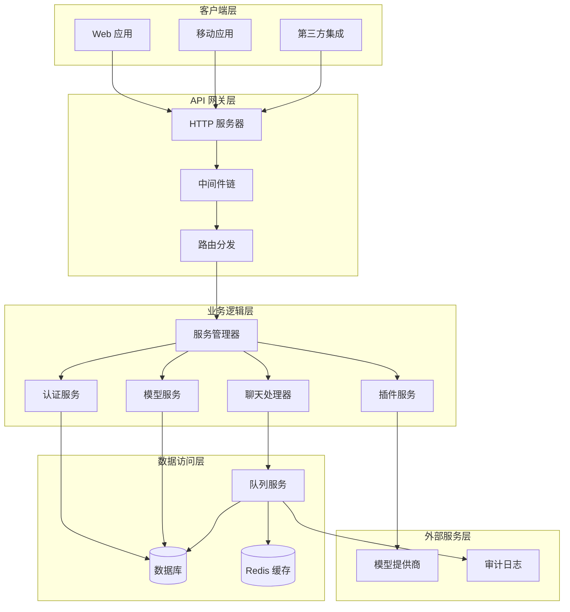
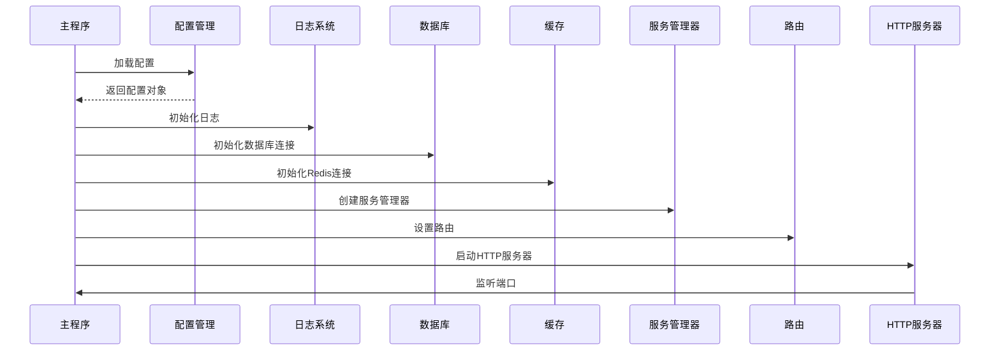
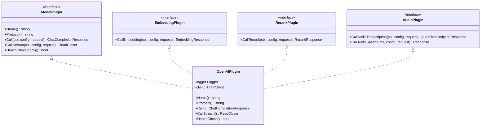
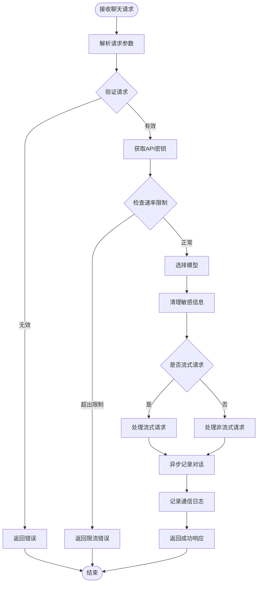
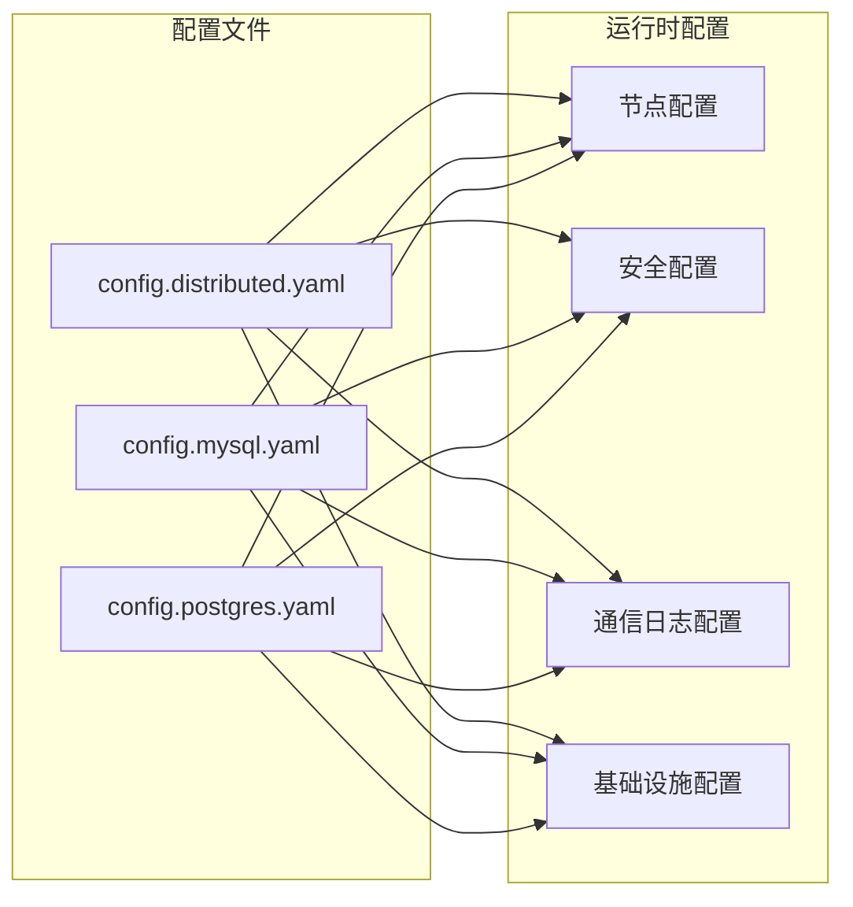
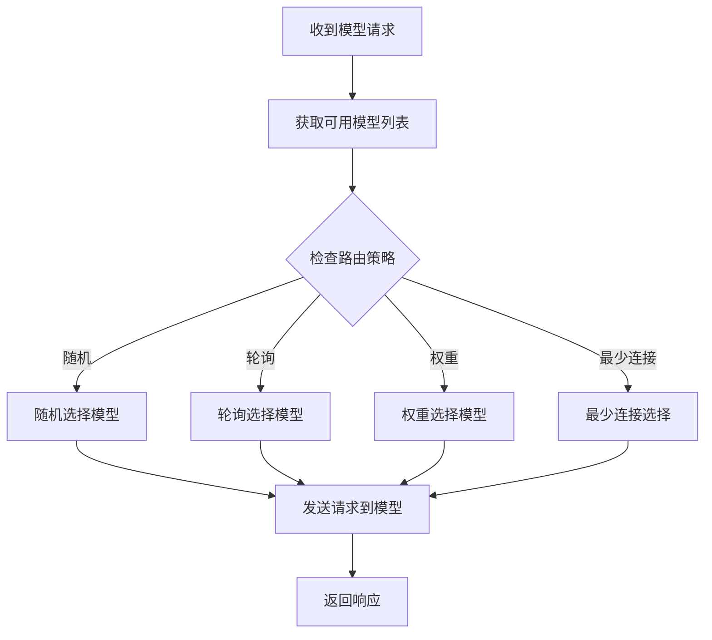
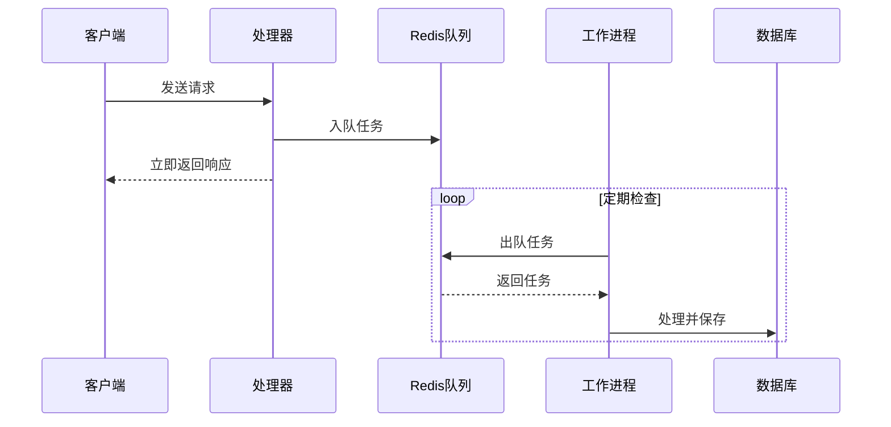
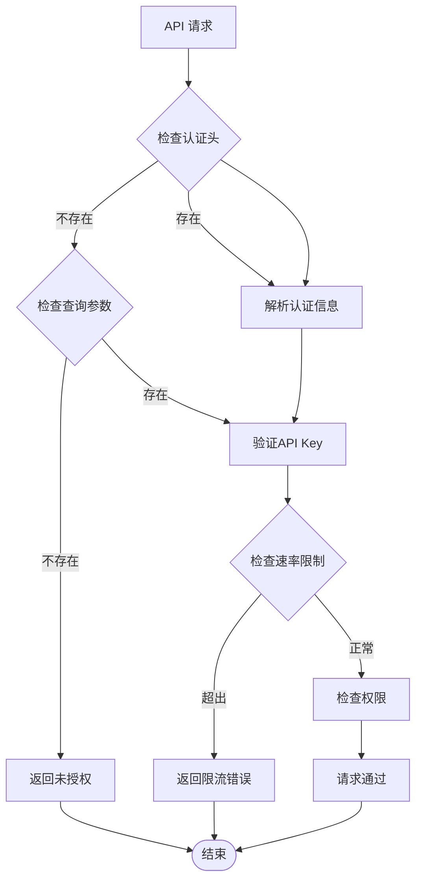
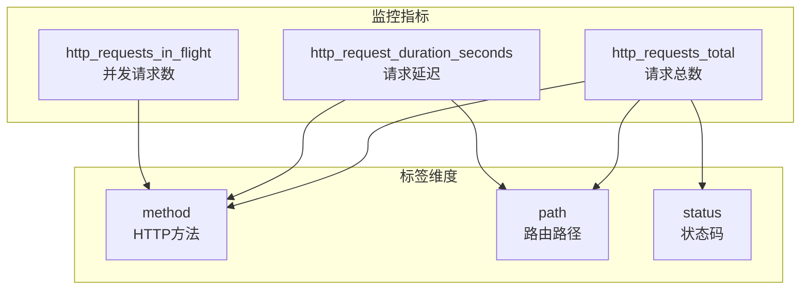

# Phase 5 规划文档

<cite>
**本文档引用的文件**
- [cmd/main.go](file://cmd/main.go)
- [internal/config/config.go](file://internal/config/config.go)
- [configs/config.distributed.yaml](file://configs/config.distributed.yaml)
- [configs/config.mysql.yaml](file://configs/config.mysql.yaml)
- [configs/config.postgres.yaml](file://configs/config.postgres.yaml)
- [internal/api/routes.go](file://internal/api/routes.go)
- [internal/services/service_manager.go](file://internal/services/service_manager.go)
- [internal/plugins/interface.go](file://internal/plugins/interface.go)
- [internal/api/handlers/chat_handler.go](file://internal/api/handlers/chat_handler.go)
- [internal/services/conversation_service.go](file://internal/services/conversation_service.go)
- [internal/plugins/plugin_openai.go](file://internal/plugins/plugin_openai.go)
- [internal/api/middleware/auth.go](file://internal/api/middleware/auth.go)
- [internal/services/queue_service.go](file://internal/services/queue_service.go)
- [internal/observability/metrics.go](file://internal/observability/metrics.go)
- [Dockerfile](file://Dockerfile)
</cite>

## 目录
1. [项目概述](#项目概述)
2. [系统架构](#系统架构)
3. [核心组件分析](#核心组件分析)
4. [分布式部署规划](#分布式部署规划)
5. [性能优化策略](#性能优化策略)
6. [安全与合规](#安全与合规)
7. [监控与可观测性](#监控与可观测性)
8. [故障排查指南](#故障排查指南)
9. [总结](#总结)

## 项目概述

WoLink Core 是一个基于 Go 语言开发的 AI 模型网关系统，支持多种大语言模型的统一接入和管理。该系统采用微服务架构设计，提供了完整的 API 网关功能，包括认证授权、流量控制、模型路由、插件扩展等核心能力。

### 主要特性

- **多模型支持**：支持 OpenAI、Claude、DeepSeek 等主流 AI 模型
- **插件化架构**：通过插件接口实现模型的灵活扩展
- **分布式部署**：支持多节点集群部署和负载均衡
- **高性能处理**：采用异步队列和流式传输优化性能
- **完整监控**：集成 Prometheus 监控指标收集

## 系统架构

**图表来源**
- [cmd/main.go:19-89](file://cmd/main.go#L19-L89)
- [internal/api/routes.go:14-129](file://internal/api/routes.go#L14-L129)
- [internal/services/service_manager.go:30-63](file://internal/services/service_manager.go#L30-L63)

## 核心组件分析

### 1. 应用启动流程

系统采用标准的 Go 应用启动模式，包含配置加载、服务初始化、路由设置和服务器启动等步骤。

**图表来源**
- [cmd/main.go:20-68](file://cmd/main.go#L20-L68)

### 2. 插件架构设计

系统采用插件化架构，通过统一的接口定义支持不同类型的 AI 模型插件。

**图表来源**
- [internal/plugins/interface.go:11-55](file://internal/plugins/interface.go#L11-L55)
- [internal/plugins/plugin_openai.go:18-370](file://internal/plugins/plugin_openai.go#L18-L370)

### 3. 聊天处理流程

系统实现了完整的聊天处理流程，包括请求验证、模型选择、流式处理和异步记录等功能。

**图表来源**
- [internal/api/handlers/chat_handler.go:34-250](file://internal/api/handlers/chat_handler.go#L34-L250)

**章节来源**
- [cmd/main.go:19-89](file://cmd/main.go#L19-L89)
- [internal/plugins/interface.go:1-55](file://internal/plugins/interface.go#L1-L55)
- [internal/plugins/plugin_openai.go:1-370](file://internal/plugins/plugin_openai.go#L1-L370)
- [internal/api/handlers/chat_handler.go:1-716](file://internal/api/handlers/chat_handler.go#L1-L716)

## 分布式部署规划

### 1. 配置管理

系统支持多种数据库配置，包括 MySQL 和 PostgreSQL，以及分布式部署的专用配置。

**图表来源**
- [configs/config.distributed.yaml:1-95](file://configs/config.distributed.yaml#L1-L95)
- [configs/config.mysql.yaml:1-37](file://configs/config.mysql.yaml#L1-L37)
- [configs/config.postgres.yaml:1-35](file://configs/config.postgres.yaml#L1-L35)

### 2. 负载均衡策略

系统支持多种负载均衡策略，包括随机选择、轮询和权重分配等。

**图表来源**
- [internal/api/handlers/chat_handler.go:78-83](file://internal/api/handlers/chat_handler.go#L78-L83)

### 3. Docker 容器化部署

系统提供完整的 Docker 配置，支持多阶段构建和轻量级运行时环境。

**章节来源**
- [configs/config.distributed.yaml:1-95](file://configs/config.distributed.yaml#L1-L95)
- [configs/config.mysql.yaml:1-37](file://configs/config.mysql.yaml#L1-L37)
- [configs/config.postgres.yaml:1-35](file://configs/config.postgres.yaml#L1-L35)
- [Dockerfile:1-28](file://Dockerfile#L1-L28)

## 性能优化策略

### 1. 异步队列处理

系统采用 Redis 队列实现异步处理，提高系统的吞吐量和响应速度。

**图表来源**
- [internal/services/queue_service.go:105-151](file://internal/services/queue_service.go#L105-L151)
- [internal/api/handlers/chat_handler.go:328-384](file://internal/api/handlers/chat_handler.go#L328-L384)

### 2. 连接池优化

系统提供完善的连接池配置，支持数据库和 Redis 的连接复用。

**章节来源**
- [internal/services/queue_service.go:17-382](file://internal/services/queue_service.go#L17-L382)
- [internal/config/config.go:34-48](file://internal/config/config.go#L34-L48)

## 安全与合规

### 1. API 认证机制

系统实现了多层次的安全防护，包括 API Key 认证、速率限制和敏感信息过滤。

**图表来源**
- [internal/api/middleware/auth.go:13-68](file://internal/api/middleware/auth.go#L13-L68)

### 2. 敏感信息保护

系统内置敏感信息检测和替换功能，支持手机号、身份证号、银行卡号等敏感信息的识别和脱敏。

**章节来源**
- [internal/api/middleware/auth.go:1-98](file://internal/api/middleware/auth.go#L1-L98)
- [internal/config/config.go:79-83](file://internal/config/config.go#L79-L83)

## 监控与可观测性

### 1. Prometheus 指标收集

系统集成了完整的 Prometheus 监控指标，包括请求计数、延迟分布和并发数等关键指标。

**图表来源**
- [internal/observability/metrics.go:12-44](file://internal/observability/metrics.go#L12-L44)

### 2. 通信日志管理

系统支持详细的通信日志记录，包括请求响应、错误信息和性能指标等。

**章节来源**
- [internal/observability/metrics.go:53-93](file://internal/observability/metrics.go#L53-L93)
- [internal/config/config.go:89-98](file://internal/config/config.go#L89-L98)

## 故障排查指南

### 1. 常见问题诊断

系统提供了完善的错误处理和日志记录机制，便于快速定位和解决问题。

### 2. 性能瓶颈分析

通过监控指标和日志分析，可以识别系统的性能瓶颈并进行针对性优化。

### 3. 配置检查清单

- 数据库连接配置是否正确
- Redis 连接池参数是否合理
- API Key 权限设置是否正确
- 模型配置是否有效
- 监控指标是否正常采集

## 总结

WoLink Core 作为一个现代化的 AI 模型网关系统，在 Phase 5 阶段展现了完整的架构设计和实现能力。系统具备以下核心优势：

1. **模块化设计**：清晰的分层架构和插件化扩展机制
2. **高性能处理**：异步队列、连接池和流式传输优化
3. **分布式支持**：多节点部署和负载均衡能力
4. **完整监控**：Prometheus 集成和详细的日志记录
5. **安全保障**：多层次的认证授权和敏感信息保护

该系统为后续的功能扩展和性能优化奠定了坚实的基础，能够满足企业级 AI 应用的复杂需求。