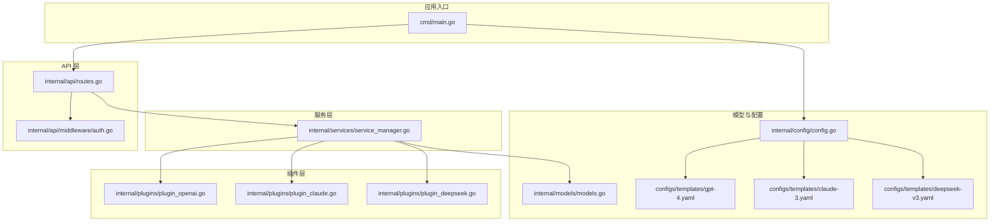
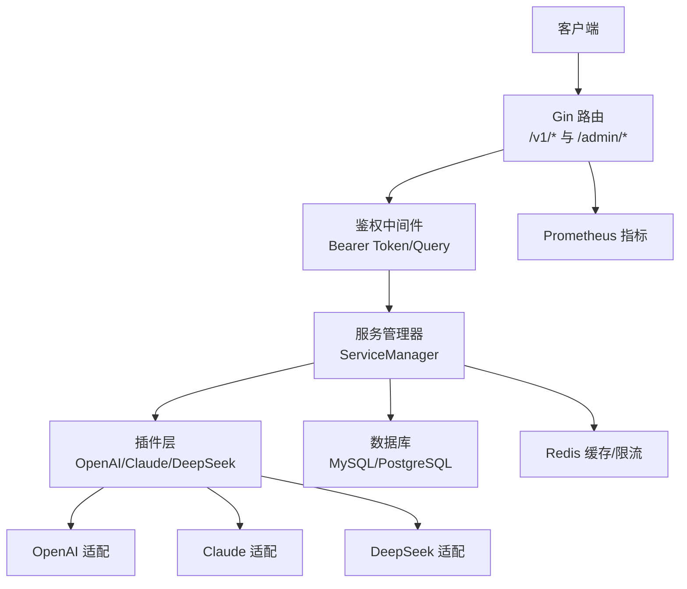
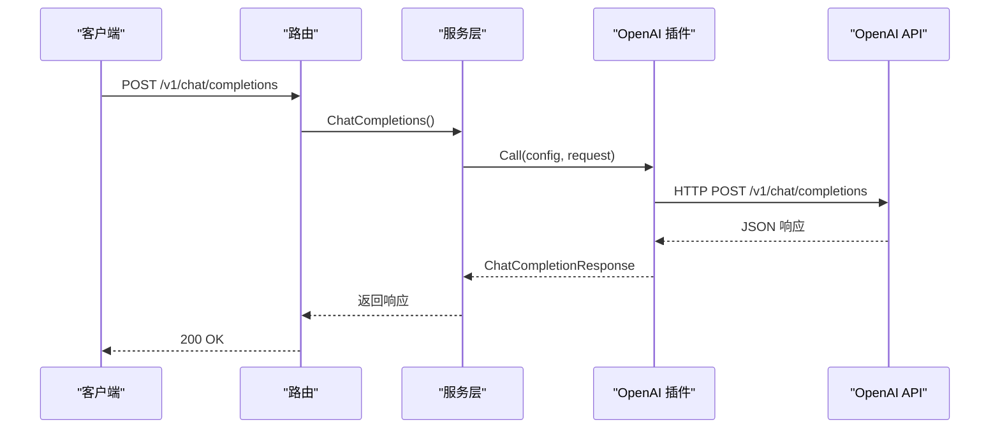
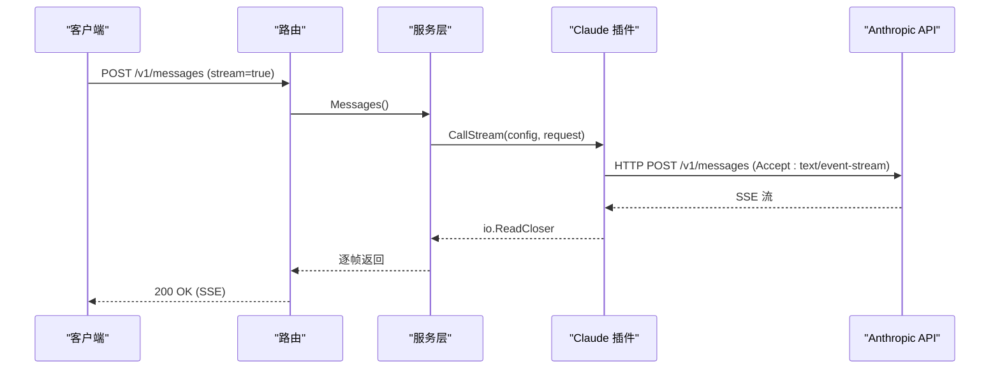
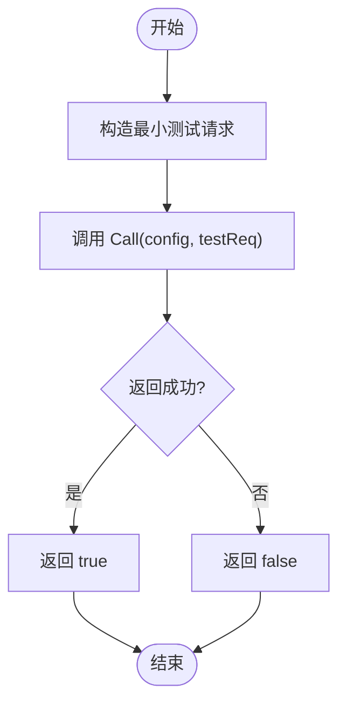
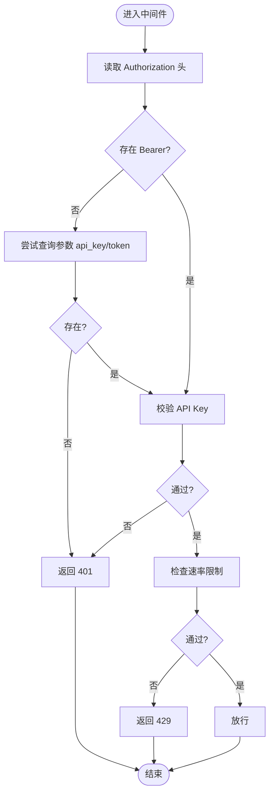
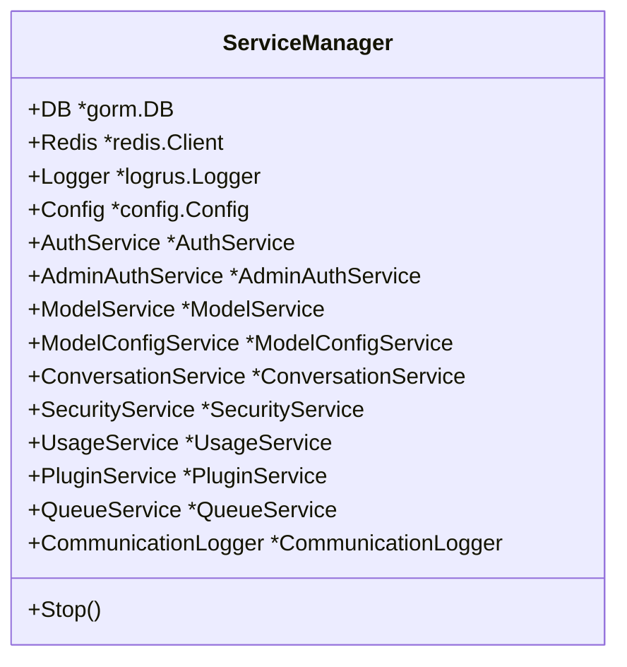
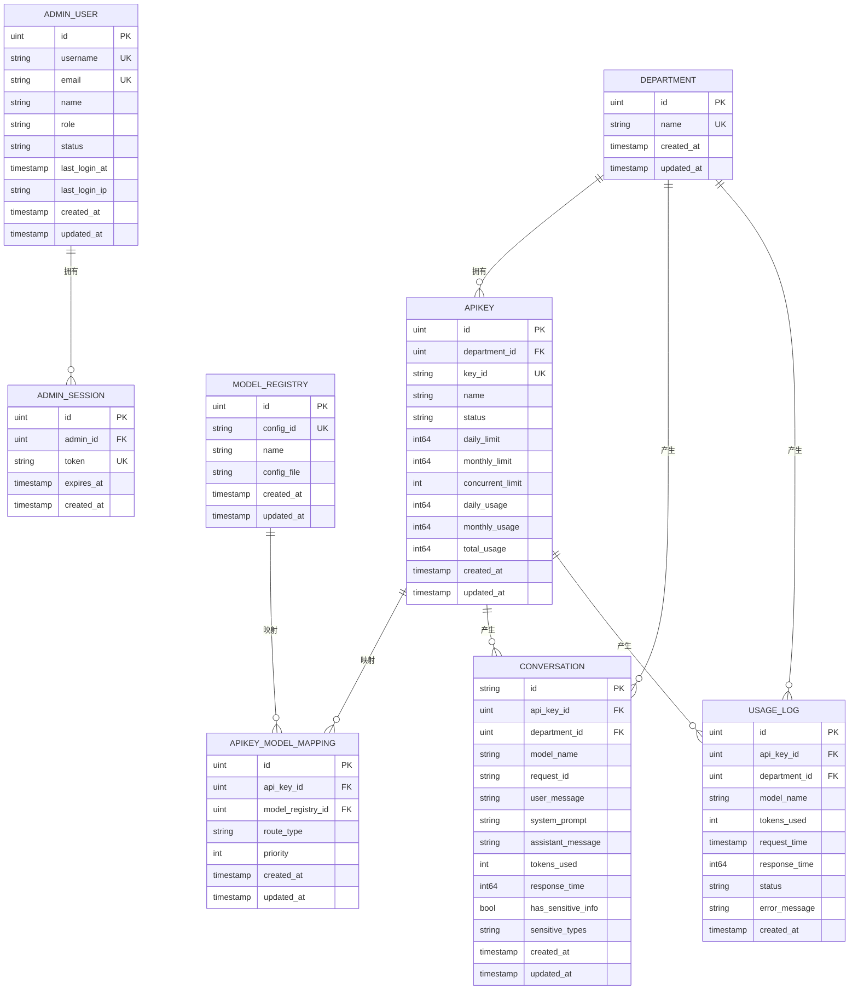
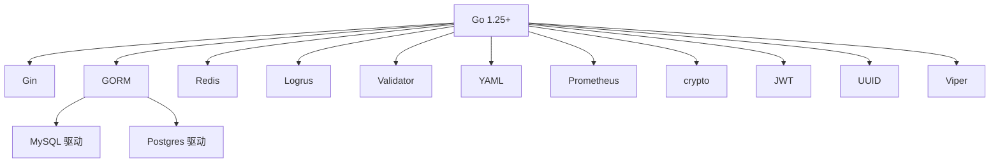

# 项目概述

<cite>
**本文引用的文件**
- [cmd/main.go](file://cmd/main.go)
- [internal/api/routes.go](file://internal/api/routes.go)
- [internal/api/middleware/auth.go](file://internal/api/middleware/auth.go)
- [internal/services/service_manager.go](file://internal/services/service_manager.go)
- [internal/plugins/plugin_openai.go](file://internal/plugins/plugin_openai.go)
- [internal/plugins/plugin_claude.go](file://internal/plugins/plugin_claude.go)
- [internal/plugins/plugin_deepseek.go](file://internal/plugins/plugin_deepseek.go)
- [internal/models/models.go](file://internal/models/models.go)
- [internal/config/config.go](file://internal/config/config.go)
- [configs/config.mysql.yaml](file://configs/config.mysql.yaml)
- [configs/config.postgres.yaml](file://configs/config.postgres.yaml)
- [configs/templates/gpt-4.yaml](file://configs/templates/gpt-4.yaml)
- [configs/templates/claude-3.yaml](file://configs/templates/claude-3.yaml)
- [configs/templates/deepseek-v3.yaml](file://configs/templates/deepseek-v3.yaml)
- [Dockerfile](file://Dockerfile)
- [docker-compose.yml](file://docker-compose.yml)
- [go.mod](file://go.mod)
</cite>

## 目录
1. [引言](#引言)
2. [项目结构](#项目结构)
3. [核心组件](#核心组件)
4. [架构总览](#架构总览)
5. [详细组件分析](#详细组件分析)
6. [依赖分析](#依赖分析)
7. [性能考虑](#性能考虑)
8. [故障排查指南](#故障排查指南)
9. [结论](#结论)
10. [附录](#附录)

## 引言
Wolink-Core 是一个企业级 AI 模型网关，旨在统一接入多家主流大模型服务（OpenAI、Claude、DeepSeek），通过标准化的 OpenAI 兼容接口对外提供聊天、嵌入、重排序、语音转写与合成等能力，并内置鉴权、限流、用量统计、敏感信息脱敏、可观测性与管理后台等功能。它适合在企业内部作为统一的 AI 能力入口，屏蔽上游模型差异，简化业务侧集成成本。

## 项目结构
项目采用分层与按职责划分的组织方式：
- cmd：应用入口，初始化配置、日志、数据库、Redis、服务管理器与 HTTP 服务器
- internal/api：路由与中间件，定义 OpenAI 兼容 API、管理后台接口与鉴权流程
- internal/services：核心业务服务（鉴权、模型配置、会话、用量、队列、安全等）
- internal/plugins：各模型提供商适配插件（OpenAI、Claude、DeepSeek）
- internal/models：数据库模型与 OpenAI/Claude/音频等请求/响应结构
- internal/config：配置加载与默认值设置
- configs：运行时配置模板与模型配置文件
- docker-compose 与 Dockerfile：容器化部署

**图表来源**
- [cmd/main.go:19-89](file://cmd/main.go#L19-L89)
- [internal/api/routes.go:14-129](file://internal/api/routes.go#L14-L129)
- [internal/api/middleware/auth.go:13-68](file://internal/api/middleware/auth.go#L13-L68)
- [internal/services/service_manager.go:30-76](file://internal/services/service_manager.go#L30-L76)
- [internal/plugins/plugin_openai.go:18-370](file://internal/plugins/plugin_openai.go#L18-L370)
- [internal/plugins/plugin_claude.go:17-248](file://internal/plugins/plugin_claude.go#L17-L248)
- [internal/plugins/plugin_deepseek.go:17-235](file://internal/plugins/plugin_deepseek.go#L17-L235)
- [internal/models/models.go:10-463](file://internal/models/models.go#L10-L463)
- [internal/config/config.go:96-185](file://internal/config/config.go#L96-L185)

**章节来源**
- [cmd/main.go:19-89](file://cmd/main.go#L19-L89)
- [internal/api/routes.go:14-129](file://internal/api/routes.go#L14-L129)
- [internal/config/config.go:96-185](file://internal/config/config.go#L96-L185)

## 核心组件
- 应用入口与生命周期
  - 加载配置、初始化日志、数据库与 Redis、构建服务管理器、创建 Gin 路由、启动 HTTP 服务器并支持优雅关闭
- 路由与中间件
  - 定义 /health、/ready、/metrics、/v1/* 等 OpenAI 兼容接口；管理后台 /admin/*；鉴权中间件支持 Bearer Token 与查询参数；CORS 与结构化日志
- 服务管理器
  - 统一管理鉴权、模型配置、会话、安全、用量、插件、队列与通信日志等服务，并在停止时优雅关闭
- 插件体系
  - OpenAI 兼容插件：支持非流式与流式聊天、音频转写与语音合成
  - Claude 插件：支持非流式与流式消息、响应格式转换
  - DeepSeek 插件：支持非流式与流式聊天、音频转写与语音合成
- 数据模型
  - 部门、API Key、模型注册表、会话、用量日志、管理员用户与会话等
- 配置系统
  - YAML 配置文件与环境变量前缀，支持 MySQL/PostgreSQL、Redis、日志级别、安全策略与基础设施超时等

**章节来源**
- [cmd/main.go:20-89](file://cmd/main.go#L20-L89)
- [internal/api/routes.go:14-129](file://internal/api/routes.go#L14-L129)
- [internal/api/middleware/auth.go:13-68](file://internal/api/middleware/auth.go#L13-L68)
- [internal/services/service_manager.go:11-76](file://internal/services/service_manager.go#L11-L76)
- [internal/plugins/plugin_openai.go:18-370](file://internal/plugins/plugin_openai.go#L18-L370)
- [internal/plugins/plugin_claude.go:17-248](file://internal/plugins/plugin_claude.go#L17-L248)
- [internal/plugins/plugin_deepseek.go:17-235](file://internal/plugins/plugin_deepseek.go#L17-L235)
- [internal/models/models.go:10-463](file://internal/models/models.go#L10-L463)
- [internal/config/config.go:96-185](file://internal/config/config.go#L96-L185)

## 架构总览
Wolink-Core 采用“路由层-服务层-插件层-外部模型提供商”的分层架构。客户端通过 /v1/* OpenAI 兼容接口访问，经鉴权与限流后，由服务层选择合适的模型配置与插件，最终转发至对应模型提供商。数据库与 Redis 分别用于持久化与缓存/限流，Prometheus 中间件提供指标采集。

**图表来源**
- [internal/api/routes.go:14-129](file://internal/api/routes.go#L14-L129)
- [internal/api/middleware/auth.go:13-68](file://internal/api/middleware/auth.go#L13-L68)
- [internal/services/service_manager.go:30-76](file://internal/services/service_manager.go#L30-L76)
- [internal/plugins/plugin_openai.go:18-370](file://internal/plugins/plugin_openai.go#L18-L370)
- [internal/plugins/plugin_claude.go:17-248](file://internal/plugins/plugin_claude.go#L17-L248)
- [internal/plugins/plugin_deepseek.go:17-235](file://internal/plugins/plugin_deepseek.go#L17-L235)

## 详细组件分析

### 组件 A：OpenAI 兼容插件
- 功能要点
  - 非流式与流式聊天调用，自动合并默认参数，透传原始请求体
  - 健康检查：构造最小请求验证可用性
  - 音频转写与语音合成：基于 multipart/form-data 与 /v1/audio/* 路径
- 关键流程（非流式调用）

**图表来源**
- [internal/api/routes.go:52-53](file://internal/api/routes.go#L52-L53)
- [internal/plugins/plugin_openai.go:42-121](file://internal/plugins/plugin_openai.go#L42-L121)

**章节来源**
- [internal/plugins/plugin_openai.go:18-370](file://internal/plugins/plugin_openai.go#L18-L370)

### 组件 B：Claude 插件
- 功能要点
  - 构造 Claude 消息格式，必要参数补齐（如 max_tokens）
  - 将 Claude 响应转换为 OpenAI 兼容格式
  - 支持非流式与流式调用
- 关键流程（流式调用）

**图表来源**
- [internal/api/routes.go:55-56](file://internal/api/routes.go#L55-L56)
- [internal/plugins/plugin_claude.go:101-148](file://internal/plugins/plugin_claude.go#L101-L148)

**章节来源**
- [internal/plugins/plugin_claude.go:17-248](file://internal/plugins/plugin_claude.go#L17-L248)

### 组件 C：DeepSeek 插件
- 功能要点
  - 非流式与流式聊天，参数透传与默认值合并
  - 健康检查：最小请求验证可用性
  - 音频转写与语音合成支持
- 关键流程（健康检查）

**图表来源**
- [internal/plugins/plugin_deepseek.go:204-234](file://internal/plugins/plugin_deepseek.go#L204-L234)

**章节来源**
- [internal/plugins/plugin_deepseek.go:17-235](file://internal/plugins/plugin_deepseek.go#L17-L235)

### 组件 D：鉴权与限流中间件
- 功能要点
  - 支持 Authorization: Bearer 与查询参数 api_key/token
  - 校验 API Key 有效性与速率限制
  - 结构化日志与跨域处理
- 关键流程（API Key 校验）

**图表来源**
- [internal/api/middleware/auth.go:13-68](file://internal/api/middleware/auth.go#L13-L68)

**章节来源**
- [internal/api/middleware/auth.go:13-68](file://internal/api/middleware/auth.go#L13-L68)

### 组件 E：服务管理器与依赖注入
- 功能要点
  - 统一初始化与持有 DB、Redis、Logger、Config
  - 管理 AuthService、AdminAuthService、ModelService、ConversationService、UsageService、PluginService、QueueService、CommunicationLogger
  - 启动时加载模型配置，停止时优雅关闭
- 类关系图

**图表来源**
- [internal/services/service_manager.go:11-76](file://internal/services/service_manager.go#L11-L76)

**章节来源**
- [internal/services/service_manager.go:30-76](file://internal/services/service_manager.go#L30-L76)

### 组件 F：数据模型与关系
- 关键实体
  - 部门、API Key、模型注册表、API Key 与模型映射、会话、用量日志、管理员用户与会话
- 关系图

**图表来源**
- [internal/models/models.go:10-463](file://internal/models/models.go#L10-L463)

**章节来源**
- [internal/models/models.go:10-463](file://internal/models/models.go#L10-L463)

## 依赖分析
- 技术栈
  - 语言与框架：Go 1.25+、Gin Web 框架
  - ORM：GORM（MySQL/PostgreSQL 驱动）
  - 缓存：Redis（go-redis）
  - 日志：Logrus
  - 验证：go-playground/validator
  - YAML：gopkg.in/yaml.v3
  - 指标：Prometheus client
  - 加解密：golang.org/x/crypto
  - JWT：github.com/golang-jwt/jwt/v5
  - UUID：github.com/google/uuid
- 配置与环境
  - Viper 读取 configs/config.*.yaml 与环境变量（AI_GATEWAY_*）
- 容器化
  - Dockerfile 多阶段构建，docker-compose 启动 mysql 与 redis

**图表来源**
- [go.mod:5-22](file://go.mod#L5-L22)
- [internal/config/config.go:96-185](file://internal/config/config.go#L96-L185)

**章节来源**
- [go.mod:5-22](file://go.mod#L5-L22)
- [internal/config/config.go:96-185](file://internal/config/config.go#L96-L185)

## 性能考虑
- 连接池与超时
  - 数据库与 Redis 连接池参数可配置，默认最大连接数、空闲连接数与生命周期已设定
  - HTTP 服务器读/写/空闲/头部读取超时可配置，保障长连接与慢查询稳定性
- 流式响应
  - Claude 与 OpenAI/DeepSeek 的流式调用通过 SSE/流式读取返回，降低首字节延迟
- 缓存与限流
  - Redis 用于限流与会话状态存储，建议结合业务并发与 QPS 调优
- 日志与指标
  - 结构化日志与 Prometheus 中间件便于定位性能瓶颈与容量规划

[本节为通用指导，不直接分析具体文件]

## 故障排查指南
- 常见问题定位
  - 鉴权失败：确认 Authorization 头或查询参数 api_key/token 是否正确传递
  - 速率限制：检查 API Key 的并发与日/月限额是否触发
  - 数据库/Redis 连接：核对配置文件与环境变量，查看连接池参数
  - 插件健康检查：OpenAI/Claude/DeepSeek 插件均提供健康检查方法，可用于快速验证
- 建议步骤
  - 查看 /health 与 /ready 接口状态
  - 开启更详细的日志级别进行复现
  - 使用 /metrics 观察指标变化
  - 核对模型配置文件与 conn_config 的 base_url、api_key、model、超时等

**章节来源**
- [internal/api/routes.go:39-44](file://internal/api/routes.go#L39-L44)
- [internal/api/middleware/auth.go:13-68](file://internal/api/middleware/auth.go#L13-L68)
- [internal/plugins/plugin_openai.go:195-229](file://internal/plugins/plugin_openai.go#L195-L229)
- [internal/plugins/plugin_claude.go:150-161](file://internal/plugins/plugin_claude.go#L150-L161)
- [internal/plugins/plugin_deepseek.go:204-234](file://internal/plugins/plugin_deepseek.go#L204-L234)

## 结论
Wolink-Core 通过清晰的分层设计与插件化扩展，为企业提供统一、可观测、可治理的 AI 模型网关能力。依托 OpenAI 兼容接口，快速对接多家模型提供商，配合完善的鉴权、限流、用量统计与管理后台，满足企业级应用的安全与运营需求。

[本节为总结性内容，不直接分析具体文件]

## 附录

### 部署与配置要点
- 配置文件
  - MySQL/PostgreSQL 与 Redis 的主机、端口、账号密码等
  - 日志级别、安全敏感词与替换模式、模型配置路径
- 模板模型
  - gpt-4.yaml、claude-3.yaml、deepseek-v3.yaml 提供了各模型的默认参数与连接配置示例
- 容器化
  - Dockerfile 多阶段构建，docker-compose 启动 mysql 与 redis，并暴露 8080 端口

**章节来源**
- [configs/config.mysql.yaml:1-37](file://configs/config.mysql.yaml#L1-L37)
- [configs/config.postgres.yaml:1-35](file://configs/config.postgres.yaml#L1-L35)
- [configs/templates/gpt-4.yaml:1-75](file://configs/templates/gpt-4.yaml#L1-L75)
- [configs/templates/claude-3.yaml:1-75](file://configs/templates/claude-3.yaml#L1-L75)
- [configs/templates/deepseek-v3.yaml:1-101](file://configs/templates/deepseek-v3.yaml#L1-L101)
- [Dockerfile:1-28](file://Dockerfile#L1-L28)
- [docker-compose.yml:1-59](file://docker-compose.yml#L1-L59)